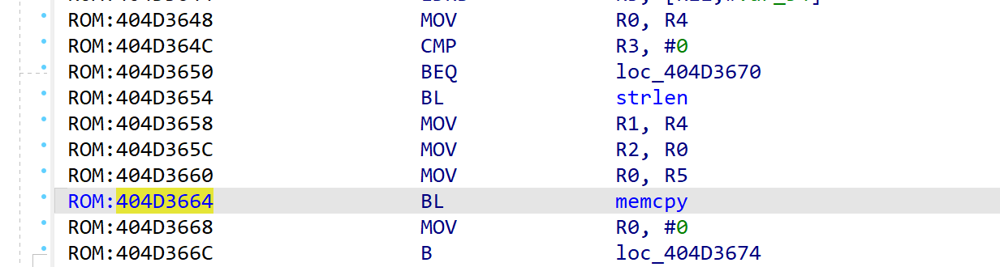
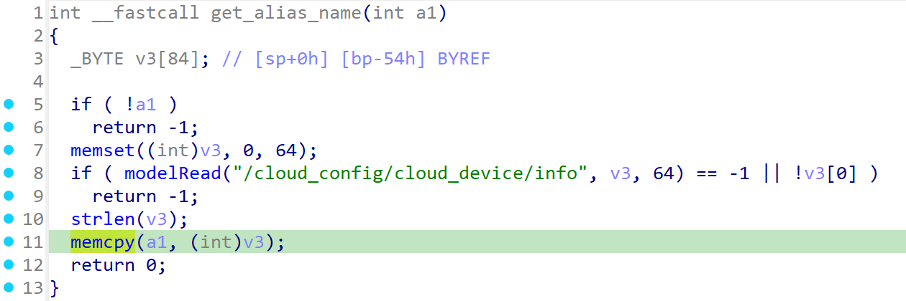
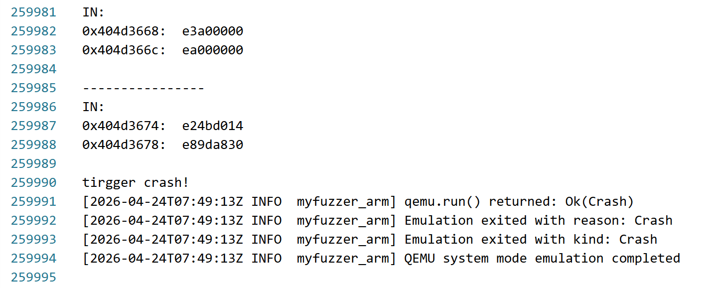
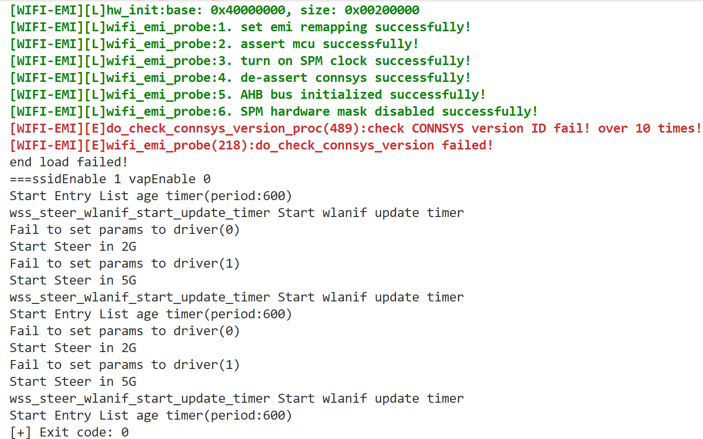

# Overview
Details of the vulnerability found in the tplink router TL-WDR7620.

| Firmware Name  | Firmware Version  | Download Link  |
| -------------- | ----------------- | -------------- |
| TL-WDR7620    |  20190725_2.0.12    | https://service.tp-link.com.cn/detail_download_8635.html   |


# Vulnerability details
## 1. Vulnerability trigger Location
A stack overflow vulnerability exists in the invocation logic of `devDiscoverNotify()` in the firmware. The vulnerability trigger path is `devDiscoverNotify -> update_advertisement_frame -> get_alias_name -> memcpy` (offset `0x404D3664`). It is triggered when a user submits a JSON request through the web interface to set `cloud_config.info.alias`, which invokes the `devDiscoverNotify` logic. If the provided content is an overly long string, a stack overflow vulnerability can be triggered during the call to `memcpy`.


## 2. Vulnerability  Analysis
- The root cause of this vulnerability lies in the lack of proper boundary checking for the alias length in `get_alias_name()`. The program allocates only about 64 bytes of space for the alias field in the broadcast packet, but directly copies a user-controlled, overly long alias into the destination buffer using `memcpy(a1, v3)` without validating its size. This results in overwriting adjacent memory regions and causes a stack overflow. In more severe cases, this memory corruption can be further exploited to achieve remote code execution.

# POC
## python script
```python
import socket

ip = "192.168.0.1"   # target ip
file_path = "./payload.txt"   

with open(file_path, "rb") as f:
    payload = f.read()

print(f"[+] Loaded {len(payload)} bytes from {file_path}")

s = socket.socket(socket.AF_INET, socket.SOCK_STREAM)
s.connect((ip, 80))

s.sendall(payload)

response = s.recv(4096)
print(response.decode(errors="ignore"))

s.close()
```


# Vulnerability Verification Screenshot
##  wdr7620
- Use `binwalk -Me` to extract the `10400` file from the original firmware (the firmware’s operating system is VxWorks, and this file is the main binary), along with the symbol table file `15CBC1`. Then, we used a self-developed emulation tool specifically designed for VxWorks to start the service and perform validation.




# Discoverer
m202472188@hust.edu.cn HUST IOTS&P lab
