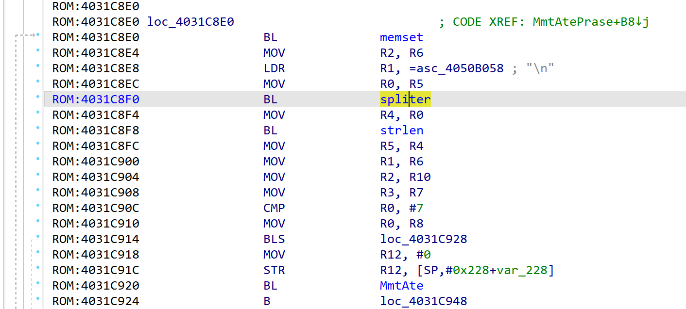
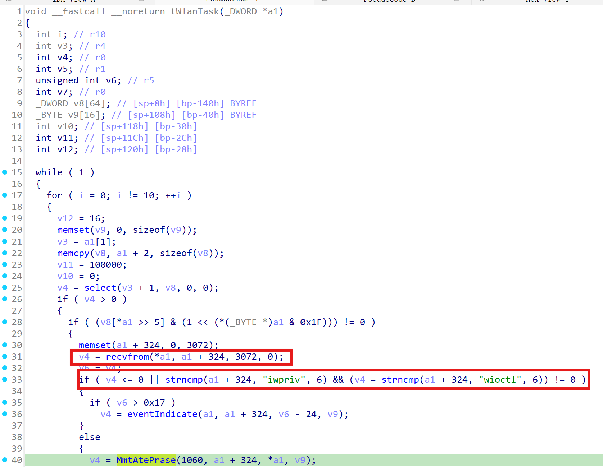
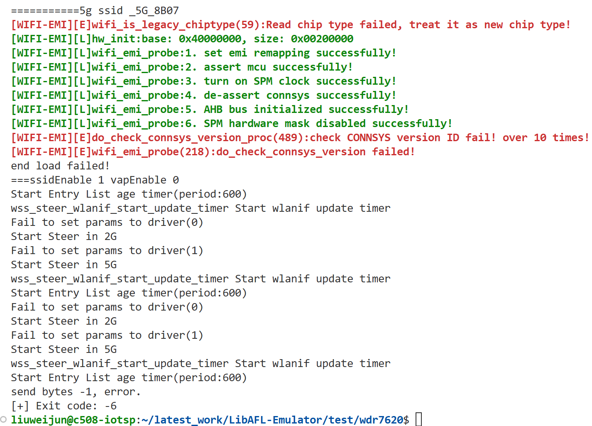
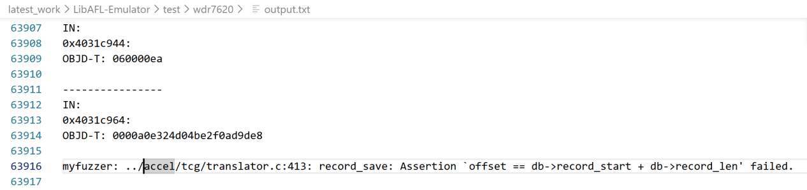
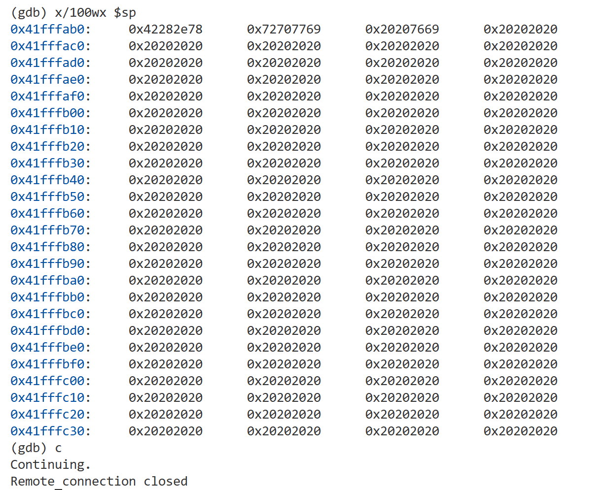

# Overview
Details of the vulnerability found in the tplink router TL-WDR7620.

| Firmware Name  | Firmware Version  | Download Link  |
| -------------- | ----------------- | -------------- |
| TL-WDR7620    |  20190725_2.0.12    | https://service.tp-link.com.cn/detail_download_8635.html   |


# Vulnerability details
## 1. Vulnerability trigger Location
A stack-based buffer overflow vulnerability exists in the `MmtAtePrase` function within `_tWlanTask` in the firmware (at offset 0x4031C8F0). At this location, the `spliter` function is called without proper boundary checking. A specially crafted POST request can trigger the overflow.


## 2. Vulnerability  Analysis
- This vulnerability occurs when the `twlantask` component processes incoming UDP packets (on port 1060). The program can receive up to 3072 bytes of data, and when the packet begins with `iwpriv` or `wioctl`, it enters the `MmtAtePrase` handling logic.
- In `MmtAtePrase`, the input string is split by `'\n'` and stored in `v11`. However, `v11` can hold at most 512 bytes. If the incoming data exceeds this limit, a stack overflow will occur, leading to a service crash.



# POC
## python script
```python
from pwn import *
r = remote("192.168.1.1", 1060, typ="udp")
payload = "wioctl".ljust(3070) + "\n"
r.send(payload)
```


# Vulnerability Verification Screenshot
##  wdr7620
- Use `binwalk -Me` to extract the `10400` file from the original firmware (the firmware’s operating system is VxWorks, and this file is the main binary), along with the symbol table file `15CBC1`. Then, we used a self-developed emulation tool specifically designed for VxWorks to start the service and perform validation.


- Set a breakpoint at `0x4031C8F4` using GDB, which confirms that a stack overflow indeed occurs, as shown below.


# Discoverer
m202472188@hust.edu.cn HUST IOTS&P lab
