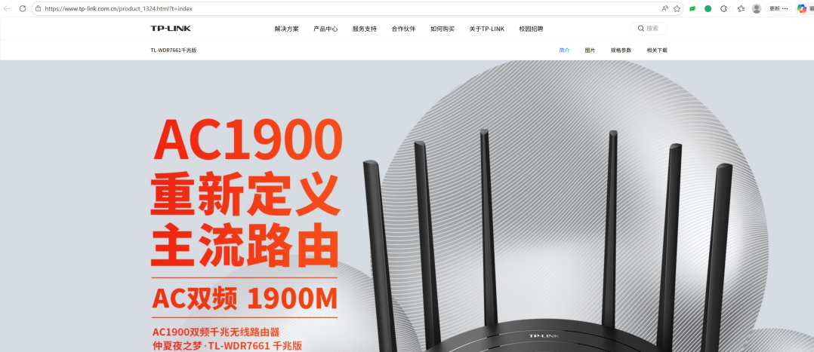
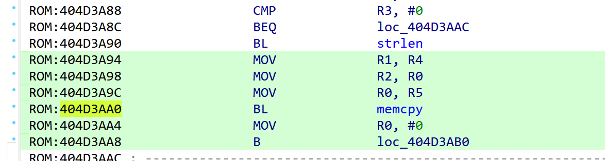
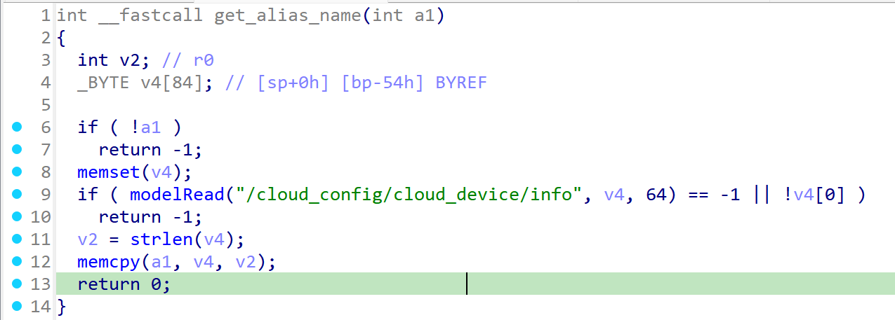
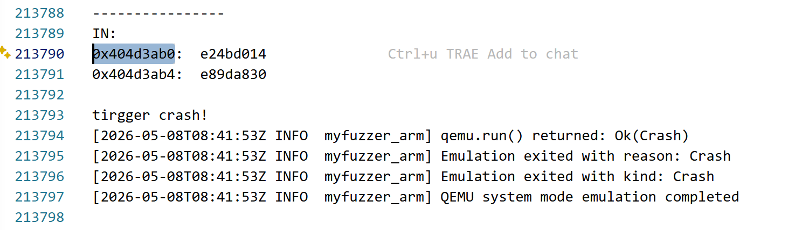

# Overview

Details of the vulnerability found in the TP-LINK router TL-WDR7661.

| Firmware Name | Firmware Version | Download Link |
| -------------- | ---------------- | ------------- |
| TL-WDR7661 | V1.0_2.0.4_Build_190725_Rel.42251n | https://smb.tp-link.com.cn/service/detail_download_8633.html |

Product page:

```text
https://www.tp-link.com.cn/product_1324.html?t=index
```



# Vulnerability details

## 1. Vulnerability trigger Location

A stack overflow vulnerability exists in the invocation logic of `devDiscoverNotify()` in the firmware. The vulnerability trigger path is:

```text
devDiscoverNotify -> update_advertisement_frame -> get_alias_name -> memcpy
```

It is triggered when a user submits a JSON request through the Web interface to set `cloud_config.info.alias`, which invokes the `devDiscoverNotify` logic. If the provided content is an overly long string, a stack overflow vulnerability can be triggered during the call to `memcpy`.

Relevant symbols:

| Function | Address |
| --- | --- |
| `memcpy` | `0x4028FF74` |
| `cloudMsgSetAliasHandle` | `0x404A4538` |
| `devDiscoverNotify` | `0x404D1640` |
| `get_alias_name` | `0x404D3A3C` |
| `update_advertisement_frame` | `0x404D41DC` |

The vulnerable copy site was observed around `0x404D3AA0`.



## 2. Vulnerability Analysis

- The root cause of this vulnerability lies in the lack of proper boundary checking for the alias length in `get_alias_name()`.
- The program reserves only about `64` bytes for the alias field in the advertisement packet, but directly copies a user-controlled alias into the destination buffer using `memcpy` without validating its size. This results in overwriting adjacent memory regions and causes a stack overflow. In more severe cases, this memory corruption can be further exploited to achieve remote code execution.



# POC

## python script

```python
import socket

ip = "192.168.0.1"   # target ip
file_path = "./payload.txt"

with open(file_path, "rb") as f:
    payload = f.read()

print(f"[+] Loaded {len(payload)} bytes from {file_path}")

s = socket.socket(socket.AF_INET, socket.SOCK_STREAM)
s.connect((ip, 80))

s.sendall(payload)

response = s.recv(4096)
print(response.decode(errors="ignore"))

s.close()
```

# Vulnerability Verification Screenshot

## wdr7661

- Use `binwalk -Me` to extract the `10400` file from the original firmware. The firmware's operating system is VxWorks, and this file is the main binary. The symbol table file was also used during analysis. Then, we used a self-developed emulation tool specifically designed for VxWorks to start the service and perform validation.




# Discoverer

m202472188@hust.edu.cn HUST IOTS&P lab
