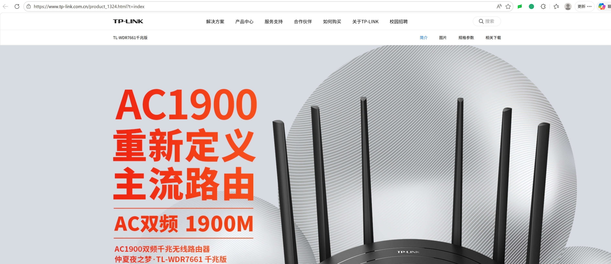
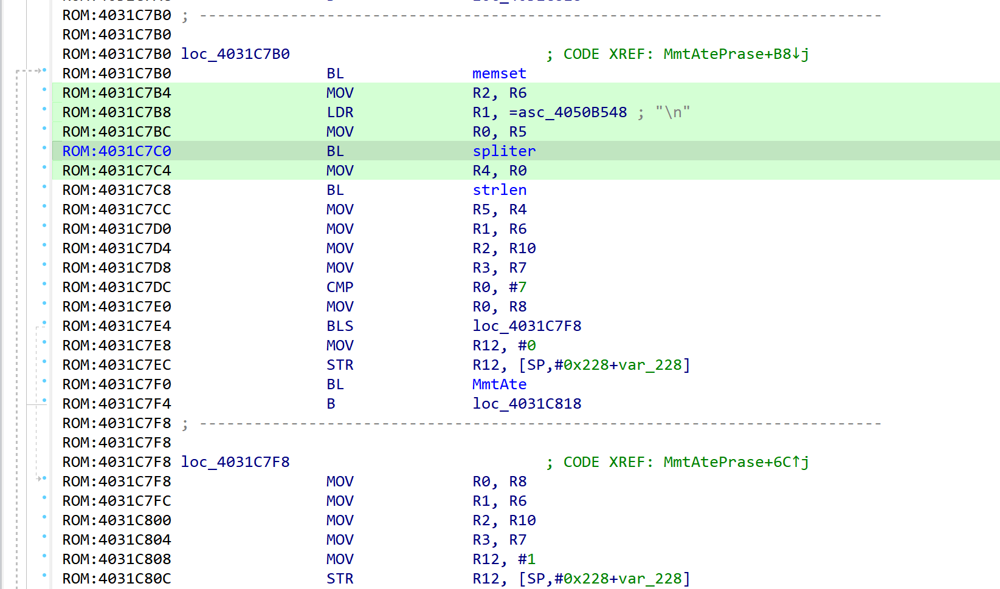
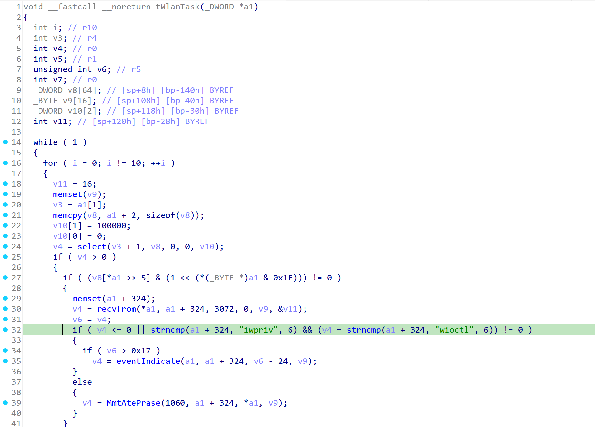
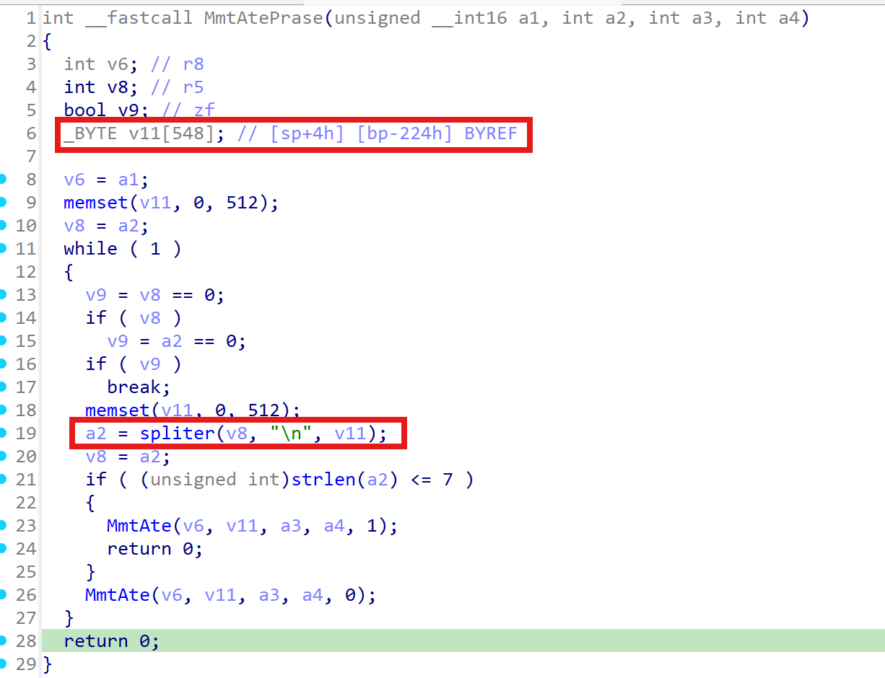
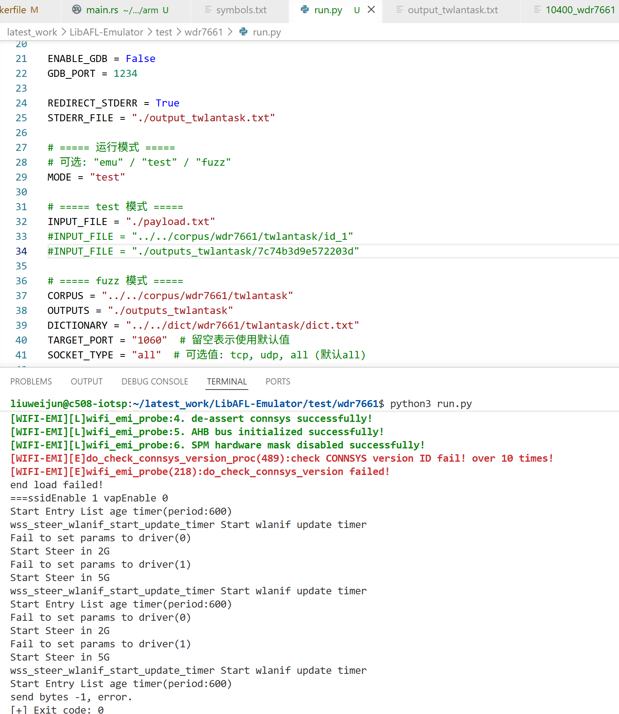
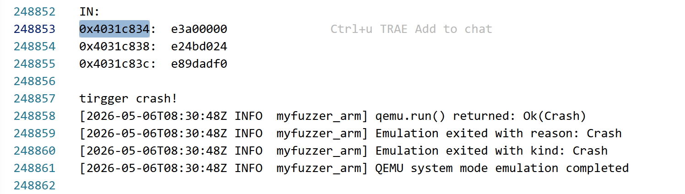

# Overview

Details of the vulnerability found in the TP-LINK router TL-WDR7661.

| Firmware Name | Firmware Version | Download Link |
| -------------- | ---------------- | ------------- |
| TL-WDR7661 | V1.0_2.0.4_Build_190725_Rel.42251n | https://smb.tp-link.com.cn/service/detail_download_8633.html |

Product page:

```text
https://www.tp-link.com.cn/product_1324.html?t=index
```



# Vulnerability details

## 1. Vulnerability trigger Location

A stack-based buffer overflow vulnerability exists in the `MmtAtePrase` function within `_tWlanTask` in the firmware. The vulnerable function is located at `0x4031C778`, and the vulnerable code path reaches the `spliter` function at `0x402902CC` without proper boundary checking. A specially crafted UDP packet can trigger this vulnerability.

Relevant symbols:

| Function | Address |
| --- | --- |
| `spliter` | `0x402902CC` |
| `_tWlanTask` | `0x403097B8` |
| `MmtAtePrase` | `0x4031C778` |



## 2. Vulnerability Analysis

- This vulnerability occurs when the `twlantask` component processes incoming UDP packets on port `1060`. The program can receive up to `3072` bytes of data, and when the packet begins with `iwpriv` or `wioctl`, it enters the `MmtAtePrase` handling logic.
- In `MmtAtePrase`, the input string is split by `'\n'` and stored in a fixed-size stack buffer. The destination buffer can hold only about `512` bytes. If the incoming data exceeds this limit, a stack-based buffer overflow occurs, leading to service crash and possibly further control-flow corruption.




# POC

## python script

```python
from pwn import *

r = remote("192.168.1.1", 1060, typ="udp")
payload = "wioctl".ljust(3070) + "\n"
r.send(payload)
```

# Vulnerability Verification Screenshot

## wdr7661

- Use `binwalk -Me` to extract the `10400` file from the original firmware. The firmware's operating system is VxWorks, and this file is the main binary. The symbol table file was also used during analysis. Then, we used a self-developed emulation tool specifically designed for VxWorks to start the service and perform validation.




# Discoverer

m202472188@hust.edu.cn HUST IOTS&P lab
